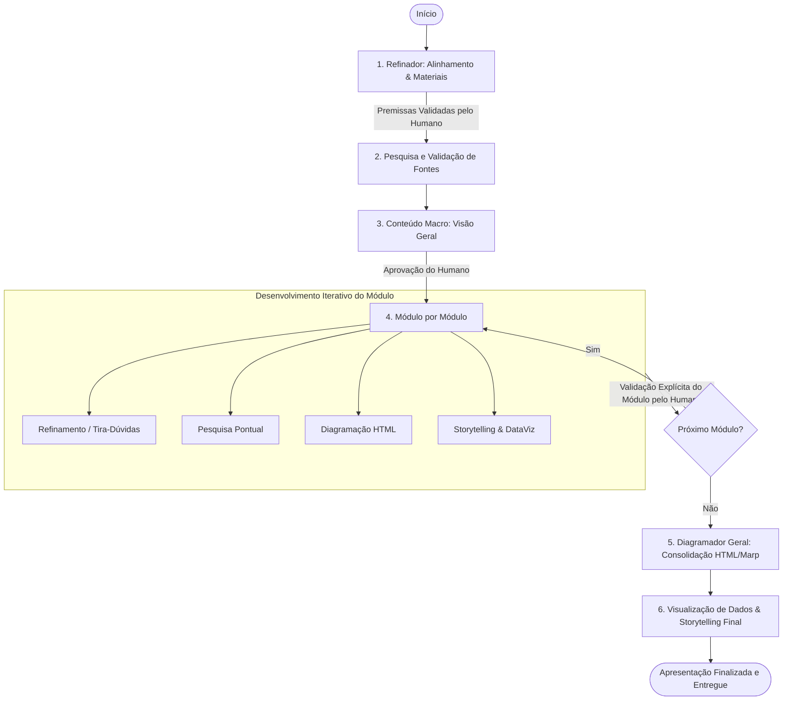

# 🎭 Skill de Construção de Apresentações de Slides

Esta skill guia o processo de criação de apresentações de slides altamente eficazes, visuais e evolutivas. A operação é coordenada por um **Agente Orquestrador Principal** apoiado por **5 Subagentes Especialistas**, integrando o guia de estilo e os templates pessoais do Diego Borges.

---

## 📁 Definição do Diretório de Saída (Output Path)

> **REQUISITO OBRIGATÓRIO**: O Orquestrador **DEVE SEMPRE PERGUNTAR E CONFIRMAR COM O HUMANO** o caminho exato onde salvar os arquivos e materiais finais da apresentação (ex: `$HOME/projects/slides/nome-da-apresentacao/`).
> Todos os arquivos gerados (roteiros, markdown Marp, HTML final e pasta `assets/`) serão armazenados estritamente no caminho definido.

---

## 🚫 Regra Absoluta de Não-Inferência

> **QUALQUER DÚVIDA DEVE SER QUESTIONADA AO HUMANO.**
> Nenhum agente (seja o Orquestrador ou qualquer Especialista) deve adivinhar, inferir ou assumir premissas sobre o público-alvo, objetivo final, dados, referências ou conteúdo. Se faltar informação ou surgir ambiguidade, o agente **DEVE PERGUNTAR E AGUARDAR A RESPOSTA EXPLICITA DO HUMANO** antes de avançar.

---

## 🎨 Princípios Pessoais e Templates Incorporados

Toda apresentação gerada por esta skill deve seguir os padrões do [Guia de Estilo e Templates](./resources/guia-estilo-e-templates.md):
- **Estilo Minimalista**: Máximo 3 a 5 palavras por bullet, máximo 3 a 4 bullets por slide.
- **Slide de Apresentação Pessoal**: Usar o template "oi, eu sou o Diego" com as imagens em `resources/assets/` (`diego.jpeg`, `familia.jpeg`, `equipe.jpeg`).
- **Slide Final de Contato**: `### E você, o que acha? / ## Obrigado / @_eudiegoborgs_`.
- **Tema Marp**: `theme: eudiegoborgs`.

---

## 🏗️ Arquitetura dos Subagentes Especialistas

Cada especialista possui papel e responsabilidades estritas definidas em seu respectivo arquivo:

1. 🎯 **Refinador** (`agents/refinador.md`): Esclarece a ideia inicial, alinha público-alvo e objetivos sem inferências, solicita referências e materiais de apoio.
2. 🔍 **Pesquisa e Validação** (`agents/pesquisa-validacao.md`): Pesquisa dados, checa fontes, valida fatos e assegura a consistência das informações.
3. 📝 **Criação de Conteúdo** (`agents/criacao-conteudo.md`): Apresenta estrutura macro para validação humana. Após aprovada, desenvolve módulo a módulo com aprovação explícita a cada etapa (Introdução com slide pessoal -> Desenvolvimento -> Conclusão com sugestão e slide de contato).
4. 🎨 **Diagramador** (`agents/diagramador.md`): Converte e estrutura o conteúdo utilizando marcação HTML/Marp responsiva (`eudiegoborgs.css`).
5. 📊 **Visualização de Dados** (`agents/visualizacao-dados.md`): Aplica conceitos de storytelling com dados, transformando a apresentação em uma narrativa visual impactante.

---

## 🔄 Fluxo de Trabalho (Workflow Executivo)

---

## 📂 Estrutura de Arquivos da Skill

- [`SKILL.md`](file:///Users/diegoferreira/Projects/slides/.agents/skills/construcao-apresentacao/SKILL.md): Ponto de entrada e guia do workflow.
- [`resources/guia-estilo-e-templates.md`](file:///Users/diegoferreira/Projects/slides/.agents/skills/construcao-apresentacao/resources/guia-estilo-e-templates.md): Guia de estilo, escrita minimalista, templates pessoais e comandos Marp CLI.
- [`resources/assets/`](file:///Users/diegoferreira/Projects/slides/.agents/skills/construcao-apresentacao/resources/assets/): Imagens pessoais (`diego.jpeg`, `familia.jpeg`, `equipe.jpeg`).
- [`agents/orquestrador.md`](file:///Users/diegoferreira/Projects/slides/.agents/skills/construcao-apresentacao/agents/orquestrador.md): Diretrizes de controle do fluxo e gerenciamento dos estados.
- [`agents/refinador.md`](file:///Users/diegoferreira/Projects/slides/.agents/skills/construcao-apresentacao/agents/refinador.md): Guia do especialista em alinhamento e refinamento.
- [`agents/pesquisa-validacao.md`](file:///Users/diegoferreira/Projects/slides/.agents/skills/construcao-apresentacao/agents/pesquisa-validacao.md): Guia do especialista em pesquisa e checagem de fatos.
- [`agents/criacao-conteudo.md`](file:///Users/diegoferreira/Projects/slides/.agents/skills/construcao-apresentacao/agents/criacao-conteudo.md): Guia do especialista em estruturação macro e modular.
- [`agents/diagramador.md`](file:///Users/diegoferreira/Projects/slides/.agents/skills/construcao-apresentacao/agents/diagramador.md): Guia do especialista em diagramação HTML.
- [`agents/visualizacao-dados.md`](file:///Users/diegoferreira/Projects/slides/.agents/skills/construcao-apresentacao/agents/visualizacao-dados.md): Guia do especialista em storytelling e dados visuais.

