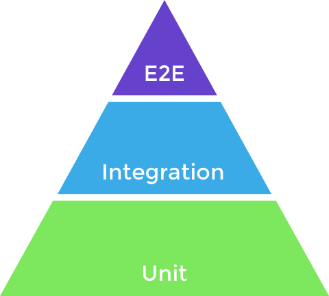
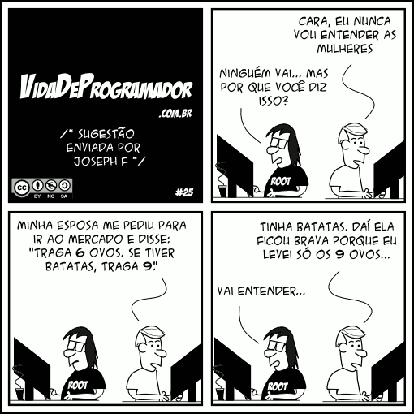

## oi, eu sou o Diego
<div class="self-image">


</div>

---

- mineiro, de `Belorizonti` **(oncovim)**
- pai do **Bryan**, do **Arthur** e da **Emily**
- esposo da **Stéfanny**
- **músico** de garagem
- **desenvolvedor** desde 2011
- tech manager coordenador de um **time incrível**
- e muitas outras coisas... 🍕🍰¢🍫🍖🌕🎸🚗🏍️🐶♾️

<div class="family-image">


</div>
<div class="team-image">


</div>

---

# Cultura de Testes
## E sua importância para devs e non devs

---

## Uma história que se repete em muitos lugares...

---

# Este é o Enzo:

- Trabalha com tecnologia há 5 anos
- Sempre sobrecarregado de trabalho
- Nunca entrega no prazo
- Tarefas sempre retornam para ajustes
- Recebe ligações no fim de semana
- Tem 26 anos


---

# O que é teste de software?

---

# Automático vs Manual

---

# O Preço dos Testes

---

# O Preço dos Testes

- Quanto mais próximo do topo do funil...
- ... mais lento e caro se torna o teste.



---

# E2E (End to End)

- Teste completo do sistema
- Contempla todas as features e fluxos
- Dependências internas e externas
- 🔴 **Mais lento e caro**

---

# Integration (Feature)

- Teste intermediário
- Valida uma funcionalidade específica
- Testa dependências internas
- "Mocka" comportamento de dependências externas

---

# Unit (Unidade)

- Teste base (unidade atômica)
- Testa métodos ou funções de uma classe
- "Mocka" toda dependência daquela função
- 🟢 **Mais rápido e barato**

---

# Além da Pirâmide: Outros Testes

---

# Testes de Carga & Stress

**Carga (Load Testing):**
- Comportamento sob carga esperada
- Identifica gargalos e tempo de resposta
- _Ferramentas: k6, Artillery, Apache Bench (ab)_

**Stress Testing:**
- Comportamento além do limite esperado
- Onde o sistema quebra?
- Como ele se recupera após a falha?

---

# Testes de Contrato

- Garante que APIs mantêm contratos com consumidores
- Evita quebras de compatibilidade (breaking changes)
- Fundamental para serviços distribuídos (microsserviços)
- _Ferramentas: Pact, Spring Cloud Contract_

---

# Testes de Mutação

### "Quem testa os testes?"

- Modifica o código original (ex: troca `>` por `>=`)
- Roda a suíte de testes do projeto
- **Mutante Morto 🟢:** Teste falhou (sucesso!)
- **Mutante Sobreviveu 🔴:** Teste passou (teste incompleto!)

---

# Fitness Functions

> Como garantir que a arquitetura não degrade ao longo do tempo?

**Fitness functions** são mecanismos objetivos que verificam características e regras da arquitetura do software.

---

# Exemplos de Fitness Functions

- **Acoplamento:** Garantir que o Domínio não dependa de Infraestrutura
- **Tamanho de Classes:** Limitar arquivos a no máximo 300 linhas
- **Performance:** Endpoints demorando menos de 200ms
- **Dependências:** Evitar dependências circulares entre camadas

---

# Fitness Functions na Prática

```php
// PHPArkitect - Garantindo desacoplamento
public function testDomainNaoDependeDeInfraestrutura(): void
{
    $this->assertDoesNotDependOn(
        'App\Domain',
        'App\Infrastructure'
    );
}
```

---

# Fitness Functions na Prática

```php
// PHPArkitect - Impedindo dependências circulares
public function testNaoDeveHaverDependenciasCirculares(): void
{
    $this->assertDoesNotHaveCyclicDependencies([
        'App\Domain',
        'App\Application',
        'App\Infrastructure'
    ]);
}
```

---

# Como Testar?

A maioria dos desenvolvedores são a favor dos testes, mas **discordam em como testar...**

---

# A Cultura

## ... é o fator mais importante no trabalho com testes.

---

## Sem uma cultura de testes é muito difícil trabalhar com testes.

---

# Toda Cultura...

## ... é dependente das pessoas.

---

# Por que não testar?

### O que faz um desenvolvedor não querer trabalhar com testes?

---

## Falta de conhecimento sobre o assunto

---

## Dificuldade na configuração

---

## Complexidade de escrita

---

## Falta de confiança no resultado

---

## Falta de feedback

---

## Lentidão na execução dos testes

---

# Pensando Errado

## 10 coisas sobre testes que você pode estar pensando errado

---

### 01
# Teste é importante só para o time de desenvolvimento.

---

### 02
# Essa parada de teste e qualidade é coisa de QA.

_Quem é o responsável pela qualidade do que você faz?_

---

<div style="text-align: center; width: 100%;">


</div>

---

### 03
# Eu tenho que escrever todos os testes possíveis antes de desenvolver.



---

### 04
# Testes consomem muito tempo e vão atrasar a minha feature.

**Na verdade:**
- Menos tempo procurando bugs no produto
- Menos tempo fazendo suporte e refatorando
- Maior produtividade geral

---

### 05
# Você não consegue escrever testes para uma coisa antes que essa coisa exista.

---

### 06
# Resolvo tudo com teste unitário.

---

### 07
# 100% de coverage = 0 bugs.

---

### 08
# O time de negócios/produto não vai me dar tempo pra fazer testes.

---

### 09
# Esse trem de testes é caro demais da conta, sô!

- Produto com maior qualidade
- Redução de suporte e estresse
- Maior produtividade e satisfação do cliente

---

### 10
# Legado não é testável, é detestável.

---

# Legacy Code

_It worked for 65 million years._
_No one knows how. No one knows why._

<div style="text-align: center; width: 100%;">


</div>

---

### 10
# Testes em Projeto Legado

- Teste sempre o que for feito de novo
- Comece pelas regras de negócio mais importantes
- Valide o comportamento atual (e não o ideal)
- Log, log e mais log!
- Defina: é manutenção ou evolução do legado?

💡 _Recomendação: "Working Effectively with Legacy Code" (Michael Feathers)_

---

# Quais são as vantagens de usar testes?

---

# Qualidade Proativa

## ... e menos reativa.

_O software deixa de ser adaptado à qualidade para ser baseado em qualidade._

---

## Alteração segura de trechos de código que já estão cobertos.

---

## Código mais legível e documentado.

---

## Para tornar um código mais "testável", você precisa escrever um código bom.

---

# Testabilidade

> Trabalhar com testes nos obriga a escrever códigos menos acoplados e mais coesos para se tornarem mais “testáveis”.

---

# Deploy na Sexta
## 17:59

---

<div style="text-align: center; width: 100%;">


</div>

---

# O Princípio F.I.R.S.T.

---

# **F**ast

Os testes devem ser rápidos o suficiente para que você não desanime de utilizá-los.

---

# **I**ndependent

Os testes não devem depender do resultado ou do estado do teste anterior.

---

# **R**epeatable

Os testes devem poder ser reproduzidos repetidamente em ambientes diferentes sem variar seus resultados.

---

# **S**elf-Validating

Os testes devem ser capazes de se auto-validar sem que seja necessária alguma interpretação.

---

# **T**imely

Os testes devem ser escritos antes do código que faz o teste passar.

---

# Antipadrões a Evitar ❌

- 🔴 **Testes que dependem de ordem:** O teste B só passa se o teste A rodar antes.
- 🔴 **Testes lentos desnecessários:** Banco de dados real em testes que poderiam ser unitários.
- 🔴 **Múltiplos conceitos por teste:** Tentar testar toda a regra de negócio em um único teste.
- 🔴 **Magic numbers:** Números ou strings mágicos no teste sem contexto claro do motivo.
- 🔴 **Ignorar testes falhando:** Desativar ou omitir testes quebrados em vez de corrigi-los.

---

# O que é esse tal de TDD?

TDD (_Test-Driven Development_) significa Desenvolvimento Orientado a Testes.

- Testes desenvolvidos **antes** de escrever o código.
- Processo de desenvolvimento, **não** uma técnica de testes.

---

# O Ciclo Mágico do TDD

Para dar certo, é preciso seguir rigorosamente o ciclo contínuo de ações:

## **Red 🔴 • Green 🟢 • Refactor 🔵**

---

# 01 - Novo Teste (Red 🔴)

- Escrevemos um novo teste para a nossa feature
- Sem ainda haver algo real para testar
- **Saber o que a feature vai fazer é fundamental** (especificação clara)

---

# Falhou! (Red 🔴)

## Como ainda não existe a feature, o teste está falhando.

---

# 02 - Codar (Green 🟢)

- Escrevemos o código da maneira mais simples
- O único objetivo nesta fase é **fazer o teste passar**

---

# Passou! (Green 🟢)

## Resolvemos o problema avaliado pelo teste.

_Mas ainda não acabou..._

---

# 03 - Refatorar (Refactor 🔵)

## Achou que não ia precisar mais se preocupar com padrões e boas práticas, né?

---

<div style="text-align: center; width: 100%;">


</div>

---

# 03 - Refatorar (Refactor 🔵)

- O trabalho não acaba quando o código funciona e o teste passa
- Hora de refatorar com a tranquilidade que os testes fornecem

---

# Pronto! (Green 🟢)

## Seu código só estará pronto após ser refatorado e aprovado pelo teste.

---

> "Código sem testes é código ruim. Não importa o quão bem escrito, nem se ele é bonito, orientado a objetos ou se foi bem encapsulado. Com testes, podemos alterar o comportamento de nosso código de maneira rápida e verificável."
>
> — **Michael Feathers**, _Trabalho Eficaz com Código Legado_

---

# Testes na Era de IA
## Ainda são necessários?

> "Se a IA escreve o código e o teste, por que eu preciso saber testar?"

---

# A Ilusão do Vibe Coding

- IA gera código em milissegundos.
- Bugs sutis e alucinações passam.
- Como validar sem testes?
- **Vibe coding sem testes é aventura.**

---

# O Superpoder do TDD

> "TDD me ensinou a pensar antes de escrever."

- IA executa; você direciona.
- Teste define a **especificação clara**.
- Desenhe a solução antes de codar.

---

# Piloto ou Passageiro?

- **Passageiro:** Aceita tudo da IA.
- **Piloto:** Direciona a IA com testes.
- **Se não sabe testar, você é liderado pela IA.**

---

<div style="text-align: center; width: 100%;">


</div>

---

### Podem perguntar :)
## Obrigado!

_`ferreirabdiego@gmail.com` • `@eudiegoborgs`_
