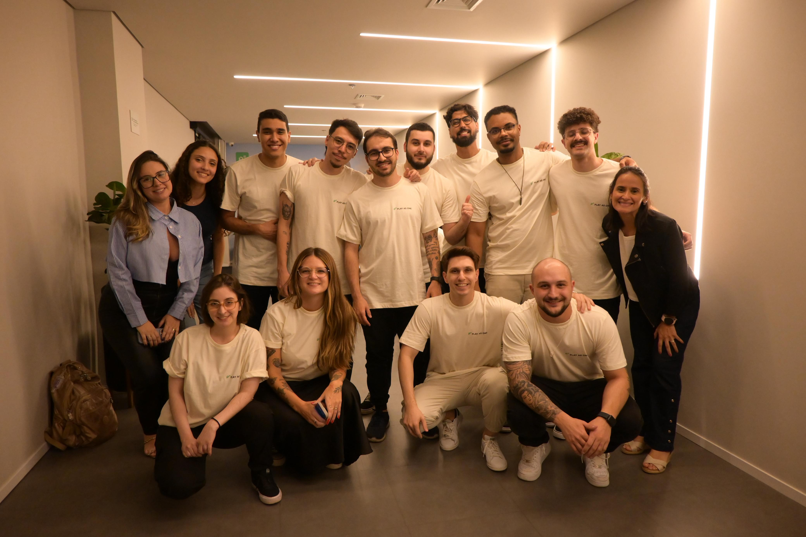

<!-- Slide 1: Capa -->
# debug de carreira
### como se destacar em processos seletivos para desenvolvedores

---

<!-- Slide 2: Apresentação Pessoal - Parte 1 -->
## oi, eu sou o Diego

---

<!-- Slide 3: Apresentação Pessoal - Parte 2 -->
- mineiro, de `Belorizonti` **(oncovim)**
- pai do **Bryan**, do **Arthur** e da **Emily**
- esposo da **Stéfanny**
- **músico** de garagem
- **desenvolvedor** desde 2011
- tech manager de um **time incrível**
- e muitas outras coisas... 🍕🍰🍫🍖🌕🎸🚗🏍️🐶♾️

---

<!-- Slide 4: Disclaimer -->
antes de começar quero dizer que:

> **tudo o que eu disser** durante essa apresentação é a **minha verdade**, baseado em **minha experiência**, mas pode se tornar **verdade para você** se fizer sentido.

---

<!-- Slide 5: Transição - Motivação -->
# motivação

---

<!-- Slide 6: Equação de Impacto -->
### pessoas mais preparadas = ecossistema saudável

---

<!-- Slide 7: Pergunta Provocativa -->
# mas quem sou eu para falar de processo seletivo?

---

<!-- Slide 8: Trajetória & Experiência -->
- trabalho com TI desde os **12 anos** (2007)
- **+15 anos** de mercado e **10 anos** como dev
- quando comecei **jQuery era inovação** (2012)
- bagagem em **Maxmilhas**, **Sympla** e **PicPay**
- responsável pelo **recrutamento técnico** do PicPay

---

<!-- Slide 9: Frase de Impacto / Aprendizado -->
com minha experiência aprendi algo:

### com paciência e um bom trabalho as coisas acontecem

---

<!-- Slide 10: O Início Real -->
- comecei na TI aos **16 anos** (2011)
- primeira vaga de dev aos **20 anos** (2015)

---

<!-- Slide 11: A Realidade da Primeira Vaga -->
> foi presencial, sem snacks, sem ambiente acolhedor, sem mesa de sinuca e com **muitos traumas**.

---

<!-- Slide 12: O Outro Lado da Mesa -->
- entrevistei **+100 pessoas** de todos os níveis
- atuação como **desenvolvedor** e **coordenador**

---

<!-- Slide 13: Transição Mitos -->
# preciso desmentir algumas coisas

---

<!-- Slide 14: A Natureza do Contrato de Trabalho -->
- contrato é uma **relação de interesses**
- possui **direitos e deveres** claros
- empresa **não faz favor**
- ninguém é contratado **apenas por ser legal**

---

<!-- Slide 15: A Régua de Senioridade -->
- cada empresa possui **sua própria régua**
- régua adaptada aos **desafios do negócio**
- Jr, Pleno e Sr indicam **maturidade naquele contexto**

---

<!-- Slide 16: A Armadilha das Exceções -->
- boas vagas exigem **preparação e esforço**
- Sr em 6 meses e Big Tech imediata são **exceções**
- **não projete sua carreira** em exceções

---

<!-- Slide 17: Slide de Impacto - Maratona -->
### construção de carreira é maratona, não é 100m rasos

---

<!-- Slide 18: Transição Contratação -->
# como contratar bem?

---

<!-- Slide 19: Perfil de Equipe -->
### cada equipe tem um perfil.
### qual é o perfil do seu time?

---

<!-- Slide 20: Perfil Formador -->
### perfil formador:
- salário menor e **alto turnover**
- plano de carreira **reduzido**
- ideal para **trabalhos constantes**

---

<!-- Slide 21: Perfil Consolidador -->
### perfil consolidador:
- salário na **média do mercado**
- **baixo turnover** e plano sólido
- ideal para **escala, migração e inovação**

---

<!-- Slide 22: Perfil Dream Team -->
### perfil dream team:
- salário **acima da média**
- **baixíssimo turnover** e estabilidade
- ideal para **sistemas de alta criticidade**

---

<!-- Slide 23: Slide de Impacto - Régua -->
### a régua é clara.

---

<!-- Slide 24: Transição Teste Técnico -->
# qual teste técnico aplicar?

---

<!-- Slide 25: Tarefa Técnica com Prazo -->
### tarefa técnica com prazo:
- valida **capacidade de execução**
- exige **conversa técnica** complementar
- muito efetivo, mas com **alta taxa de desistência**

---

<!-- Slide 26: Code Smells em Pair -->
### code smells em pair:
- valida **análise e refatoração**
- exige **conversa técnica** ativa
- efetivo, mas **sensível à pressão**

---

<!-- Slide 27: Code Challenges Online -->
### code challenges online:
- tenta validar **execução básica**
- **pouco efetivo** no mundo real
- risco de **trapaça e automação**

---

<!-- Slide 28: Whiteboard / Arquitetura -->
### whiteboard (arquitetura):
- valida **planejamento de soluções**
- indispensável **troca técnica**
- muito efetivo, mas **sensível à pressão**

---

<!-- Slide 29: Slide de Impacto - Cultural -->
### toda etapa é cultural.

---

<!-- Slide 30: Princípio de Recrutamento -->
- processo que **educa e cativa**
- **feedback é obrigatório**

---

<!-- Slide 31: Transição Como Ser Contratado -->
# como ser bem contratado?

---

<!-- Slide 32: Primeira Vaga -->
- a primeira vaga **não precisa ser perfeita**
- habilidades essenciais **só aprendemos na prática**

---

<!-- Slide 33: Apresentando sua História -->
- contar a sua versão **não é mentir**
- tenha e saiba **apresentar suas experiências**

---

<!-- Slide 34: Postura nos Testes Técnicos -->
- teste técnico **não é obrigatório** aceitar
- mas se aceitar, **faça com segurança e dedicação**

---

<!-- Slide 35: Causos do Mercado - Consulta -->
# causo da consulta à internet

---

<!-- Slide 36: Causos do Mercado - Framework -->
# causo do framework

---

<!-- Slide 37: Estudo Pró-Ativo da Empresa -->
- estude os **problemas da empresa**
- proponha **possíveis soluções**
- **não chegue de mão abanando**

---

<!-- Slide 38: Entrevista como Troca -->
- construa uma **troca de conhecimento**
- faça **perguntas relevantes**
- entrevista **não é interrogatório**

---

<!-- Slide 39: Slide de Impacto Cultural -->
### toda etapa é cultural.

---

<!-- Slide 40: Reputação e Networking -->
### as pessoas que estudam/trabalham com você te indicariam para uma vaga?

---

<!-- Slide 41: Frase de Impacto - Preparação -->
### todo mundo quer água, mas ninguém quer encher a garrafa.

---

<!-- Slide 42: O Novo Cenário da TI -->
# o processo seletivo na era da inteligência artificial.

---

<!-- Slide 43: Slide Final de Contato e Agradecimento -->
### E você, o que acha?

## Obrigado

_`@eudiegoborgs`_
