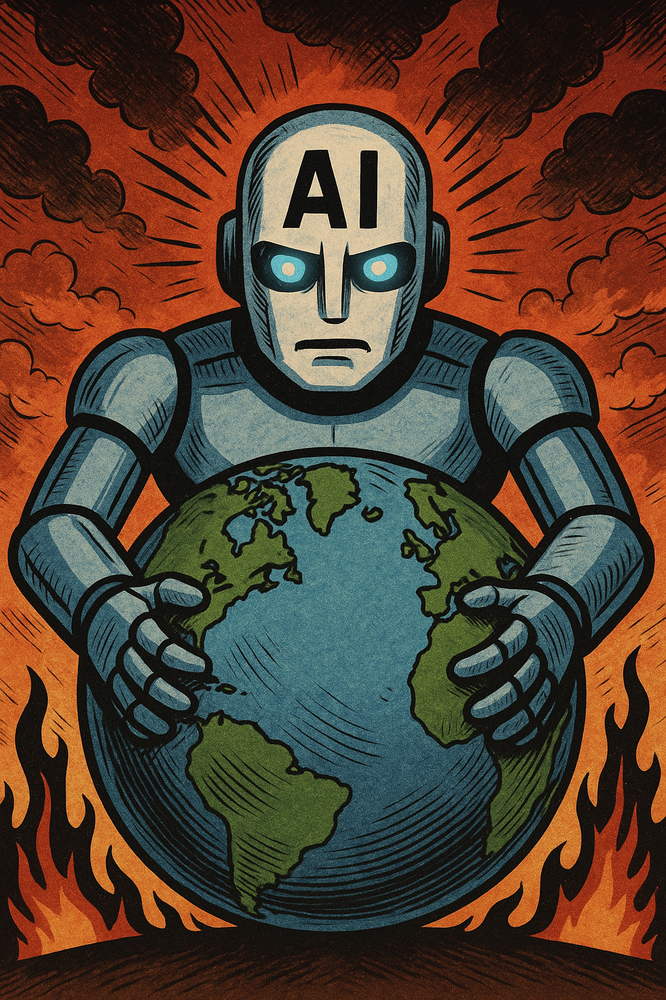
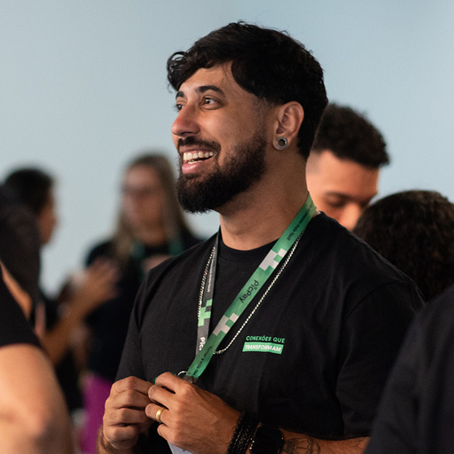

# estamos com os dias contados? 
_a relação da evolução das IA's com a_ 
_extinção do trabalho humano_

---

## oi, eu sou o Diego

---

- mineiro, de `Belorizonti` **(oncovim)**
- pai do **Bryan**, do **Arthur** e da **Emily**
- esposo da **Stéfanny**
- **musico** de garagem
- **desenvolvedor** desde 2011
- tech manager de um **time incrível**
- e muitas outras coisas... 🍕🍰🍫🍖🌕🎸🚗🏍️🐶♾️

---

_antes de começar quero dizer que..._

#### `tudo o que eu disser` durante essa   apresentação é a `minha verdade`, baseado   em `minha experiência`, mas pode se tornar   verdade para você se fizer sentido

---

### É sempre assim: 
## a gente vai ficando velho 
## e o mundo vai ficando novo

`Gilberto Gil`

---

## motivação

a cada novo modelo de IA lançado, a mesma pergunta retorna.
_As IA's vão roubar nossos trabalhos?_

---

_resposta curta:_

## se Deus quiser sim. 🙌

<small>pelo menos a parte chata do trabalho né?</small>

---

na prática isso está longe de acontecer.  por isso vamos aprofundar um pouco na questão, ok?

--- 

_nos ultimos meses, 
muito se tem falado sobre..._

**v0 &**
**Lovable &**
**Cursor &**
**Geração de imagem do gpt.**

--- 

Temos de um lado pessoas **empolgadas** com a 
possibilidade de *construir coisas de forma **independente***,
e do outro pessoas inseguras com o **futuro do trabalho**,
questionando a *legitimidade do trabalho produzido por estes modelos*.

---

## quem tá certo nessa história?

---

## a mudança é inevitável, 
## evolução, por outro lado, é opcional.
_Frase de Tony Robbins em uma tradução livre_

---

Durante diversos momentos da história moderna, a raça humana se atualizou tecnologicamente. E isso mudou completamente como algumas profissões atuam. Mas uma coisa posso afirmar com tranquilidade: `a necessidade por profissionais excelentes nunca desaparece.`

---

## A humanidade avança. 
## Profissões deixam de existir e outras nascem

---

Exemplos não faltam:

- Com a **prensa de Gutenberg**, os *copiadores de livros sumiram*.
- Com os **automóveis**, os *cocheiros perderam espaço*.
- Com a **internet**, quantas *locadoras de vídeo fecharam?*

---

E, mesmo assim, em todos esses contextos, os melhores seguiram relevantes:

- Ainda existem **especialistas em caligrafia**.
- **Motoristas** continuam existindo.
- **Influencers de cinema** são uma das *categorias mais antigas da internet*, com blogs e canais dedicados desde os anos 2000.

---

## o objetivo da tecnologia é facilitar 

---

#### não é o fim do trabalho, é o `fim do repetitivo`

_já trabalhei em lugares em que existiam pessoas dedicadas a_
_transferir dados de uma planilha para outra._

---

_se o seu trabalho é repetitivo, se você só replica e não cria_
### sinto dizer: seus dias estão contados

---

_E isso não é ruim. O mundo está exigindo um nível mais alto de entrega_ 
_— mais criativo, mais estratégico, `mais humano`._

---

### A IA ainda não tem alma (e nunca vai ter)

---

>_“Olhando as imagens como arte e não só como produtos, percebemos que estanca o desenvolvimento da arte. Pasteuriza tudo e fica tudo igual. Se acaba os ilustradores reais, as máquinas vão se alimentar só do que já existe e só aí vão perceber que ela não cria nada.”_

_Citação de uma publicação do artista de quadrinhos `@rafaelmarcal`_

---

## A IA ainda não tem criatividade genuína 
## — ela é uma excelente imitadora

---

_sejamos sinceros:_
### nem todo profissional entrega algo único

Com algum treino é possível replicar o estilo Ghibli, ou qualquer outro manualmente. A IA só democratizou essa replicação.

---

quantas músicas dá pra tocar com essa sequência? `G, D, Em, C`

_Uma IA pode criar uma música simples, mas será que ela consegue fazer isso..._

---

> _Se um dia me surgisse uma moça dessas que com seus dotes e seus dons
Inspira parte dos compositores na arte das palavras e dos sons
Tal como Madallene, de Jacques Brel ou como Madalena de Martinho
Ou Mabellene, a sixteen de Chuck Berry ou a manequim do tímido Paulinho_
> 
> _Ou como de Caymmi, a moça prosa e a musa inspiradora Doralice
Se me surgisse uma moça dessas confesso que eu talvez não resistisse
Mas veja bem, meu bem, minha querida isso seria só por uma vez
Uma vez só em toda a minha vida ou talvez duas, mas não mais que três!_

_Todas elas juntas num só ser - `Lenine`_

---

## Arte é expressão. 
### E isso a IA continua longe de fazer

---

### mas e os royalties?
_É uma discussão válida, mas não tem uma resposta simples_ 

---

- Adobe esta pagando royalties a artistas quando seus conteúdos são usados para treinar IA.

- Plataformas como Midjourney, Stable Diffusion e Deviantart estão enfrentando ações judiciais por uso de imagens sem compensação.

---

### a demanda por profissionais criativos vai só aumentar

_Um exemplo que me marcou foi o caso de uma animação (não me recordo qual) que precisou ser simplificada porque seria inviável produzir episódios na velocidade necessária com o nível de detalhe original. Hoje, com IAs, esse problema pode ser superado. `A tecnologia nos permite escalar a produção de conteúdo criativo com mais qualidade.`_

---

### mesmo com todo esse potencial, 
### IA's ainda tem grandes limitações

---

---

- Custo de energia muito alto *(por favor e obrigado)*
- Grande volume de tokens para tarefas pequenas
- Alteração não solicitada

---

_e na minha opinião, a maior limitação..._

### só da certo quando você sabe exatamente o que pedir e como pedir

Para gerar uma serie de quadrinhos de 10 frames eu precisei de cerca de **4 horas de trabalho**, ainda assim não fiquei 100% satisfeito com o resultado, não sou um bom front end, mas minha proposta artesanal ainda foi melhor do que a proposta das principais ferramentas de vibe coding.

--- 

_Prompt:_
_"Faça uma imagem para story de quadrinhos_
_do Diego lendo um livro cuja a capa diz "Como corrigir_
_bugs", ele abre o livro e na primeira página tá escrito_
_criando"_

---

## Isso me mostrou que o trabalho intelectual, 
## de entendimento, de visão criativa, ainda é insubstituível

---

_A IA não vai acabar com todas as profissões. Mas ela vai transformar profundamente como trabalhamos. O profissional que ignorar esse movimento vai ficar `obsoleto`._

---

_E isso vai impactar diversas profissões..._

---

_Para desenvolvedores, a IA vai automatizar boa parte do trabalho repetitivo, além de apoiar na pesquisa._

---

_Para artistas, uma vez que os conceitos de uma série, os detalhes de um personagem forem definidos, vai facilitar transformar esboços em artes finais detalhadas._

---

_Para nutricionistas, uma vez que compreendido o plano alimentar, um cardapio criativo pode ser criado, para o advogado, uma vez que tem a tese de defesa, um bom documento pode ser escrito, etc_

---

### além disso existe uma questão pública

### sobre geração de novos postos de trabalho

---
_para concluir_
### use a IA como forma de maximizar seu resultado, 
### não como muleta.

---
### E você, o que acha?
## Obrigado
_`@eudiegoborgs`_
