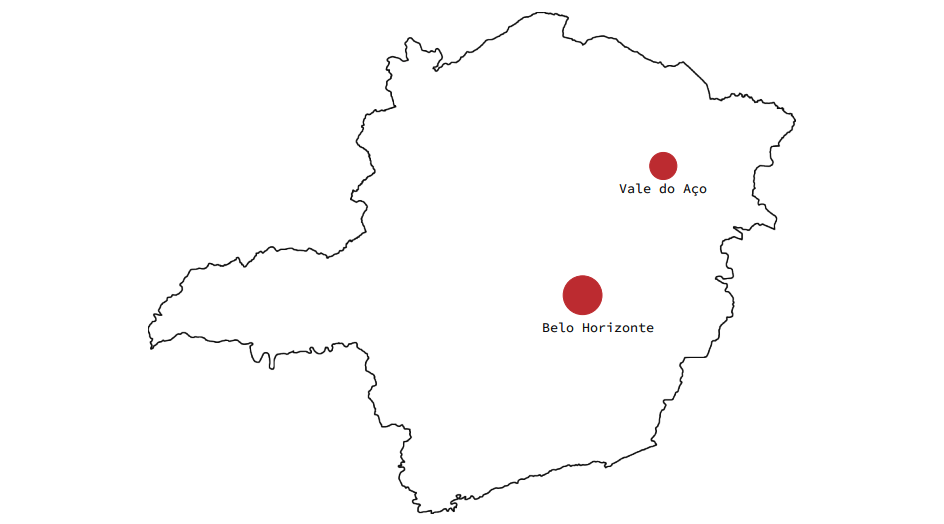

---

## A primeira comunidade PHP do Brasil 🐘🇧🇷

_Nascemos em 2005 no google foruns_

---
Nosso objetivo é:
# `Aproximar pessoas interessadas, não só em PHP mas no desenvolvimento de software em geral, gerando troca de conhecimento e interação entre profissionais, estudantes e empresas.`

---

---

## Link para a Comunidade no WhatsApp

## Link para o Feedback do Evento

---

## Código de conduta
_tl;dr Respeitar todo mundo_

`Garantir que a comunidade seja um ambiente seguro para qualquer pessoa,`
`independente de gênero, idade, orientação sexual, religião, cor de pele,`
`deficiência, nacionalidade, aparência física, tamanho ou posicionamento`
`político;`

Código completo aqui

---

## Como ajudar
_A comunidade é nossa e todo mundo pode ajudar_

- Gerando conteúdo com palestras, projetos, posts em blogs; 
- Participando de eventos para manter a comunidade ativa; 
- Interagindo no WhatsApp; 
- Ajudando na organização

---

## Big numbers de 2025

_Que ano incrivel fizemos juntos!_

- Fizemos **6 eventos** incriveis
- **745 inscrições** somadas
- Encontramos parceiros incriveis, 
    - Obrigado **Sympla**, **Onfly**, **Gestão Click** e **Dom Helder**

---

## Workshop de Arquitetura evolutiva

_Dê um upgrade na sua carreira dominando a arquitetura de software que evolui junto com o negócio!_

- Código de Qualidade (Limpo, Refatoração, Padrões de Projeto)
- Software Moderno (Microsserviços, Serverless, REST APIs)
- Estratégias Avançadas (Acoplamento Inteligente, Filas/Mensageria, SAGA)

Por apenas **R$350,00** com o cupom `PHPMG`

Se inscreva aqui

---

## Cronograma de hoje
- `19:30` - Conheça: PHPMG + Sympla
- `19:45` - Síndrome do Impostor - Andreew Januario
- `20:25` - Cultura Fail Fast - Lucca Romanelli
- `21:15` - Simplifique! Quando padrões te atrapalham - Itallo Costa

---

## Let's bora?

### Bom evento :D
_`@phpmg_`_
