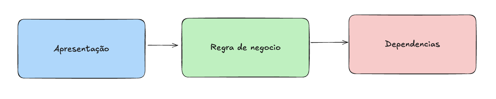

# Workshop
## Arquitetura Evolutiva

---

## oi, eu sou o Diego
<div style="position: absolute; top: 10vh; right: 0; width: 60vh; height: 60vh;">


</div>

---

- mineiro, de `Belorizonti` **(oncovim)**
- pai do **Bryan**, do **Arthur** e da **Emily**
- esposo da **Stéfanny**
- **musico** de garagem
- **desenvolvedor** desde 2011
- tech manager de um **time incrível**
- e muitas outras coisas... 🍕🍰🍫🍖🌕🎸🚗🏍️🐶♾️

<div style="position: absolute; top: 10vh; right: 5vh; width: 300px;">


</div>
<div style="position: absolute; top: 50vh; right: 5vh; width: 300px;">


</div>

---

# Tomada de Decisões Técnicas

---

### Antes de tudo...

## Comece pelo Problema

---

## 1. Entenda o Contexto

❌ **Não faça:**
_"Vamos usar microserviços!"_

✅ **Faça:**
_"Temos 3 devs, 100 usuários/dia, pouco dinheiro investido e precisamos entregar em um prazo curto..._
_Monolito modular faz sentido agora"_

---

## Contexto Importa

**Pergunte:**
### Capacity
- Qual o tamanho do time?
### Impacto
- Quantos usuários?
### Prazo
- Qual a urgência/prazo?
### Escopo 
- O que é obrigatório? Quais as restrições?
- Qual o resultado esperado (MVP)?

---

## 2. Questione e explique o "Porquê"

_Proposito importa!_

❌ **Não faça:**
_"Precisamos migrar para Kubernetes"_

✅ **Faça:**
_"Por que precisamos de Kubernetes?_
_Qual problema ele resolve?"_

---

## Os 5 Porquês
_Estresse o problema usando a técnica dos 5 porquês_

**Problema:** Deploy é lento

1. Por quê o deploy é lento? _Pipeline demora_
2. Por quê a pipeline demora? _Testes são lentos_
3. Por quê os testes são lentos? _Banco de teste é lento_
4. Por quê o banco de testes é lento? _Dados de produção_
5. Por quê usamos dados de produção? _Não temos fixtures_

_A proxima pergunta sempre usa a resposta anterior_

✅ **Solução real:** Criar fixtures, não refazer pipeline

---

## 3. Evite Soluções Prontas

❌ **Não faça:**
_"Netflix usa, vamos usar também"_

✅ **Faça:**
_"Netflix tem 10k+ devs e milhões de acessos simultaneos._
_Nós temos 5 devs e 100 usuários por dia. Não é o mesmo contexto"_

---

## Síndrome do Utopico

🦄 _"Funciona no Google..."_

- Google ≠ Sua empresa
- Spotify ≠ Sua empresa
- Amazon ≠ Sua empresa

_Empresas grandes tem problemas diferentes, entenda o proposito de cada solução e adapte ao **SEU** contexto_

---

## 4. Problema Real vs. Imaginário

❌ **Não faça:**
- _"E se tivermos 1 milhão de usuários?"_ <small>(quando tem 100)</small>
- _"E se além de passagens aéreas vendermos passagens de trem?"_

---

## 4. Problema Real vs. Imaginário

✅ **Faça:**

- _"Hoje temos 100 usuários. O problema real é onboarding lento"_
- _"Hoje vendemos passagens aéreas. Como criamos uma solução que permita vender coisas sem depender do contexto? Devemos fazer isso agora?"_

---

**❌ Problema Imaginário:**
- "E se no futuro..."
- "Talvez um dia..."
- Sem evidências
- Solução orientada a desejo

---

## Foque no Presente

**✅ Problema Real:**

- Está acontecendo agora
- Impacta usuários hoje
- Tenha evidências e dados
- Solução orientada a problema

---

## Não Esteja Só

_"Tudo parece certo_
_até que alguém venha questionar."_

**Provérbios 18:17**

---

## Evitar Estar Só

- Busque perspectivas diferentes
- Code review como conversa
- Pair programming
- Decisões compartilhadas

---

## Três Tipos de Escalabilidade

**Código** 📝
- A complexidade da realização das tarefas é resultado de decisões arquiteturais?

**Pessoas** 👥
- Novas pessoas são capazes de manter e evoluit seu projeto?

**Carga** 📊
- O projeto se mantem disponivel quando a demanda por ele cresce?

---

## Escalabilidade no Dia 0?

⚠️ **Cuidado com a armadilha**
_Escalabilidade no dia 0 é sobre time e código, nunca sobre carga_

---

## Código é Bagagem

- Mais código = mais manutenção
- Mais código = mais bugs
- Mais código = mais complexidade

**S preocupe menos código, e mais com o valor**

---

## Código é Bagagem

_Vou usar Value Object e Command Bus nesse crud de cadastro de clientes._

**Resolutado: Código verboso sem resolver problema real**

---

## A Equação da Entrega

**Escopo** ⚖️ **Qualidade** ⚖️ **Tempo**

- Se eu tenho menos tempo para fazer algo, devo reduzir o escopo ✅
- Nunca comprometer a qualidade ❌
- Redução de qualidade deve dar clareza dos riscos e ser assumida como débito <br/>_e débito cobra juros_

---

## Débito Técnico Pagável

💳 **Como dívida financeira**

- Pode ser estratégico
- Deve ter prazo
- Precisa estar visível
- Não pode virar calote

---

## Evite o HDD

**Hype Driven Development**

_ou_

**DOL - Desenvolvimento Orientado a Legalzismo**

---

## O Problema do HDD

❌ Nova tech por ser "cool", sem maturidade e ecossistema
❌ Resolver problema inexistente causa complexidade acidental
❌ Ignorar custo de adoção e equipe despreparada

---

## Pergunte Sempre

- Resolve nosso problema?
- Vale o custo?
- Time está pronto?
- É reversível?

---

## Decisões Reversíveis
### Two way door 🚪↔️

_Reduz custo de mudança_

---

## Estratégias Reversíveis

**Use Feature Flags** 🎚️
- Liga/desliga sem deploy
- Teste em produção
- Rollback instantâneo

---

## Estratégias Reversíveis

**Testes A/B**
- Compare soluções
- Dados reais
- Decida com evidências

---

## Estratégias Reversíveis

**Rollout Incremental**

- Migração gradual
- Sistema antigo + novo
- Reverte facilmente

---

## Estratégias Reversíveis

**Desacoplamento e redução de dependencia**

- Cada contexto é enxuto e depende do essencial
- Mudanças em partes não impactam o todo
- Reverte facilmente

---

## Pratique Reversibilidade

✅ Deploy sem downtime
✅ Database migrations reversíveis
✅ API versionada
✅ Configuração externa

---

## Onde aplicamos reversibilidade?

- Mudar biblioteca
- Refatorar código
- Ajustar algoritmo
- Configurar feature

_Experimente sem medo!_

---

## Decisões Irreversíveis
### One way door 🚪➡️

_Alto custo de mudança_

---

## Como Lidar com Irreversível

**1. Documente tudo** 📝
- Por que decidiu?
- Quais as alternativas?
- Qual o trade-off?

---

## Como Lidar com Irreversível

**2. Busque consenso** 👥

- Envolva o time
- Ouça objeções
- Valide com stakeholders

---

## Como Lidar com Irreversível

**3. Faça PoC** 🧪
- Teste em pequena escala
- Valide hipóteses
- Meça riscos reais

---

## Como Lidar com Irreversível

**4. Tenha plano B** 🔄
- Estratégia de contingência
- Como minimizar danos?
- Quanto custa falhar?

---

## Estratégia: One-Way Door

**Antes de atravessar:**

1. Está certo do problema?
2. Avaliou alternativas?
3. Entende o custo?
4. Time está alinhado?
5. Tem como testar?

---

## Dica de Ouro

💡 **Trate como reversível quando possível**

- Abstraia dependências
- Use interfaces
- Evite lock-in
- Mantenha opções abertas

_Mesmo o "irreversível" pode ser amenizado_

---

## Argumentação Efetiva

📊 **Dados** > Opiniões
🎯 **Fatos** > Achismos
🔍 **Contexto** > Abstração
💡 **Solução certa no tempo certo** > Solução perfeita

---

## Exemplo: Argumentação Ruim

❌ _"Precisamos migrar para microserviços porque é a melhor prática"_

**Problemas:**
- Sem dados
- Sem contexto
- Sem problema real
- Apenas opinião

---

## Exemplo: Argumentação Boa

✅ _"Deploy leva 45min e impacta 3 times._
_Monorepo com 500k linhas._
_Proposta: Modularizar em 4 serviços._
_Trade-off: Complexidade operacional vs agilidade"_

**Por quê funciona:**
- Dados concretos (45min, 3 times)
- Problema claro
- Solução específica
- Trade-offs explícitos

---

## Como Argumentar na Prática

**1. Apresente o problema**
_"Bugs em prod duplicaram no último mês"_

**2. Mostre dados**
_"15 bugs/mês → 30 bugs/mês. 70% em feature X"_

---

## Como Argumentar na Prática

**3. Explique trade-offs**
_"Adicionar testes: 2 dias + 10% mais lento CI"_
_vs_
_"Não fazer: bugs continuam, perda de confiança e aumento de custo de novas oportunidades"_

---

## Como Argumentar na Prática

**4. Proponha solução**
_"Adicionar testes E2E na feature X._
_Cobertura de 80% nos fluxos críticos"_

**5. Ouça feedback**
_"Equipe sugere começar com 50% e iterar"_

---

## Exemplo Real: Performance

❌ **Ruim:**
_"Sistema está lento, vamos usar cache"_

✅ **Bom:**
_"P95 latência: 800ms (SLA: 200ms)._
_80% das queries repetem em 5min._
_Redis cache: reduz para ~50ms._
_Custo: $50/mês + complexidade invalidação"_

---

## Exemplo Real: Refatoração

❌ **Ruim:**
_"Código está uma bagunça"_

✅ **Bom:**
_"Classe User: 2.5k linhas, 15 responsabilidades._
_PRs levam 3h+ review._
_Proposta: Extrair 5 classes por domínio._
_Reduz review para ~1h, melhora testes"_

---

## Exemplo Real: Nova Tech

❌ **Ruim:**
_"GraphQL é melhor que REST"_

✅ **Bom:**
_"Mobile faz 8 requests/tela, 2s carregamento._
_GraphQL: 1 request, ~500ms._
_Trade-off: Time precisa aprender, 2 semanas ramp-up._
_Ganho: UX melhor, menos banda mobile"_

---

## Evite Armadilhas

❌ Apelo à autoridade
_"Fulano famoso usa X"_

❌ Falsa urgência
_"Precisa ser AGORA"_

❌ Emoção sem dados
_"Eu acho que..."_

---

## Fortaleça Argumentos

✅ Use métricas
✅ Compare alternativas
✅ Mostre impacto no negócio
✅ Seja específico
✅ Admita limitações

---

## YAGNI

**You Aren't Gonna Need It**

_Você não vai precisar disso_

---

## Princípio YAGNI

- Construa o necessário
- Não antecipe funcionalidades
- Evite especulação
- Código futuro = desperdício

---

## Quando Aplicar YAGNI

✅ Features não solicitadas
✅ Abstrações prematuras
✅ "E se no futuro..."
✅ Over-engineering

---

## Quando NÃO é YAGNI

_Quando tem proposito claro_

---

## Recap: Como tomar boas decisões

1. Comece pelo problema
2. Não decida sozinho
3. Evite HDD
4. Prefira reversível
5. Argumente com dados
6. Pratique YAGNI

---

# Código de Qualidade

---

## Por Que Produzir um Código de Qualidade?

💰 **Custo de manutenção**
- 60-80% do tempo é manutenção
- Código ruim = lentidão constante

🐛 **Menos bugs**
- Código claro = menos erros

👥 **Onboarding mais rápido**
- Novos devs produzem mais rápido

---

## Código Limpo

### O Básico que Faz Diferença

---

## Nomes Revelam Intenção

❌ O que esse código faz?
```php
function calc($d, $t) {
    return $d * $t * 0.1;
}
```

---

## Nomes Revelam Intenção

✅ O que esse código faz?

```php
function calcularDescontoFidelidade($totalCompra, $tempoClienteAnos) {
    $percentualDesconto = 0.1;
    return $totalCompra * $tempoClienteAnos * $percentualDesconto;
}
```

---

## Funções Pequenas
### Single responsability
_Sua função deve ter apenas um motivo para mudar._ 

❌ **Não faça:**
- Função com 200+ linhas
- Faz validação, cálculo, persistência, email
- Impossível testar isoladamente

✅ **Faça:**
- Uma responsabilidade
- Fácil de testar e entender
- Se é dificil de testar, você tá fazendo errado

---

## Exemplo: Função Grande

❌ **Ruim:**
```php
function processarPedido($pedido) {
    // valida dados (30 linhas)
    // calcula frete (40 linhas)
    // aplica descontos (50 linhas)
    // gera nota fiscal (60 linhas)
    // envia email (20 linhas)
    // atualiza estoque (30 linhas)
}
```

---

## Exemplo: Função Pequena

✅ **Bom:**
```php
function processarPedido($pedido) {
    validarPedido($pedido);
    calcularValores($pedido);
    emitirNotaFiscal($pedido);
    notificarCliente($pedido);
    atualizarEstoque($pedido);
}
```

Cada função: 10-20 linhas, testável

---

## Comentários: Quando Usar?

❌ **Evite comentários óbvios:**
```php
// Define o nome do usuário
$usuario->setNome($nome);

// Retorna verdadeiro
return true;
```

✅ **Use para explicar "porquê":**
```php
// Workaround: API Pagamento retorna 500 após 3 tentativas
// Bug reportado: TICKET-1234. Remover quando corrigido
$maxTentativas = 2;

// Regex complexa para validar CPF com/sem formatação
// Fonte: Receita Federal - Portaria 123/2020
$pattern = '/^\d{3}\.?\d{3}\.?\d{3}-?\d{2}$/';
```

---

## Quando Abrir Mão?

⚠️ **Código limpo pode esperar:**
- Protótipo/PoC rápido
- Script descartável
- Prazo crítico (mas documente como débito!)

**Nunca abra mão em:**
- Código de produção
- Bibliotecas compartilhadas
- Lógica de negócio crítica

---

## Refatoração

### Melhorar Sem Quebrar

---

## O Que é Refatoração?

**Reestruturar código sem mudar comportamento**

✅ Melhorar legibilidade
✅ Reduzir complexidade
✅ Facilitar manutenção

❌ Não é: reescrever tudo
❌ Não é: adicionar features

---

## Técnicas de Refatoração

**Extract Method**
- Função grande → várias pequenas

**Rename**
- Nomes ruins → nomes claros

**Remove Duplication**
- DRY (Don't Repeat Yourself)

**Simplify Conditionals**
- IFs complexos → funções nomeadas

---

## Exemplo: Extract Method

❌ **Antes:**
```php
function calcularTotal($items) {
    $total = 0;
    foreach ($items as $item) {
        $total += $item->preco * $item->quantidade;
    }
    // aplicar desconto
    if ($total > 1000) {
        $total = $total * 0.9;
    }
    return $total;
}
```

---

## Exemplo: Extract Method

✅ **Depois:**
```php
function calcularTotal($items) {
    $subtotal = somarItems($items);
    return aplicarDesconto($subtotal);
}

function somarItems($items) {
    return array_reduce($items, function($sum, $item) {
        return $sum + $item->preco * $item->quantidade;
    }, 0);
}

function aplicarDesconto($valor) {
    return $valor > 1000 ? $valor * 0.9 : $valor;
}
```

---

## Quando Refatorar?

**Regrinha de escoteiro:**
_"Deixe o código mais limpo do que encontrou"_

✅ **Faça:**
- A cada feature
- No code review
- Quando adicionar testes
- Quando estiver difícil de entender

---

## Estratégia de Refatoração

1. **Tenha testes** ✅
2. **Pequenos passos** 🐾
3. **Commit frequente** 💾
4. **Um de cada vez** 1️⃣

_Sem testes = não é refatoração, é aventura_

---

## Quando NÃO Refatorar?

⚠️ **Evite:**
- Código sem testes (primeiro, adicione testes!)
- Véspera de release
- Código que será deletado
- Sistema legado crítico (use Strangler)

---

## Isolamento de Camadas

### Organize Seu Código

---

## Por Que Isolar Camadas?

🔄 **Mudança isolada**
- Troca banco sem mexer no domínio

🧪 **Testes mais fáceis**
- Mock da camada externa

📦 **Reutilização**
- Lógica não duplicada

---

## Arquitetura em Camadas



---

## Exemplo: Sem Isolamento

❌ **Ruim:**
```php
function criarUsuario($request) {
    // valida request
    // conecta banco
    // salva dados
    // envia email
    // retorna response
    // tudo misturado!
}
```

**Problemas:**
- Impossível testar sem banco
- Troca de framework = reescrever tudo
- Lógica duplicada

---

## Exemplo: Com Isolamento

✅ **Bom:**

```php
// Camada Apresentação
class UserController {
    public function create(Request $request) { /* ... */ }
}

// Camada Domínio

class CreateUserUseCase {
    public function handle(User $user) { /* ... */ }
}

// Camada Infraestrutura
class UserRepository {
    public function save(User $user) { /* ... */ }
}
```

---

## Regra de Dependência

**Camadas internas NÃO dependem de externas**

✅ Domínio → independente
✅ Aplicação → depende do Domínio
✅ Infra → depende de tudo

❌ Domínio depender de Framework
❌ Domínio depender de Banco

_O dominico se comunica com o mundo através de contratos_

---

## Quando Usar Camadas?

✅ **Use quando:**
- Aplicação de médio/grande porte
- Múltiplas interfaces (web, API, CLI)
- Lógica de negócio complexa

⚠️ **Pode abrir mão:**
- CRUD simples
- Script pequeno
- Protótipo rápido

---

## Estratégia de Implantação

**Comece simples:**
1. Separe lógica de negócio da infra
2. Adicione camada de serviço
3. Isole repositórios
4. Refine conforme cresce

_Não precisa de Clean Architecture no dia 0_

---

## Padrões de Projeto

### Soluções Comprovadas

---

## O Que São Padrões?

**Soluções recorrentes para problemas comuns**

✅ Vocabulário comum
✅ Soluções testadas
✅ Menos bugs

❌ Não é: usar por usar
❌ Não é: over-engineering

---

## Padrões Essenciais

**Repository** 📦
- Abstrai acesso a dados

**Factory** 🏭
- Criação de objetos complexos, só para objetos complexos

**Service** 🎯
- Isolar regras de negocio, quando existirem

---

## Exemplo: Repository

❌ **Sem padrão:**
```php
// controller acessa BD diretamente
$users = $db->query("SELECT * FROM users");
```

✅ **Com Repository:**
```php
// controller usa abstração
$users = $userRepository->findAll();

// implementação isolada
class UserRepository {
    public function findAll() {
        return $this->db->query("SELECT * FROM users");
    }
}
```

---

## Exemplo: Strategy

**Problema:** Múltiplos métodos de pagamento

```php
class PagamentoService {
    public function processar($metodo, $valor) {
        if ($metodo == "credito") {
            // lógica cartão
        } elseif ($metodo == "pix") {
            // lógica pix
        }
        // muito if/else!
    }
}
```

---

## Exemplo: Strategy

✅ **Com Strategy:**
```php
class PagamentoCredito {
    public function processar($valor) { /* ... */ }
}

class PagamentoPix {
    public function processar($valor) { /* ... */ }
}

// uso
$estrategia = $estrategias[$metodo];
$estrategia->processar($valor);
```

Adicionar novo método = nova classe

---

## Exemplo Completo: Strategy

**Contexto:** Sistema de cálculo de frete

```php
// Interface Strategy
interface CalculadoraFrete {
    public function calcular($peso, $distancia);
}

// Estratégias Concretas
class FreteExpresso implements CalculadoraFrete {
    public function calcular($peso, $distancia) {
        return $peso * 2.5 + $distancia * 0.8;
    }
}

class FreteEconomico implements CalculadoraFrete {
    public function calcular($peso, $distancia) {
        return $peso * 1.0 + $distancia * 0.3;
    }
}
```

---

## Exemplo Completo: Strategy

```php
// Context - usa a estratégia
class PedidoService {
    private $calculadoraFrete;
    
    public function setCalculadora(CalculadoraFrete $calc) {
        $this->calculadoraFrete = $calc;
    }
    
    public function calcularFrete($pedido) {
        return $this->calculadoraFrete->calcular(
            $pedido->peso,
            $pedido->distancia
        );
    }
}

// Uso
$service = new PedidoService();
$service->setCalculadora(new FreteExpresso());
$frete = $service->calcularFrete($pedido);
```

---

## Pattern: Service Layer

**Organiza lógica de negócio em serviços**

✅ **Quando usar:**
- Orquestrar múltiplas operações
- Lógica complexa que não cabe em um Model
- Reutilizar lógica entre controllers

---

## Exemplo: Service Layer

❌ **Sem Service:**
```php
// Controller faz tudo
class PedidoController {
    public function criar(Request $request) {
        // validar pedido
        // calcular total
        // verificar estoque
        // processar pagamento
        // enviar email
        // atualizar estoque
        // salvar pedido
        // muito código no controller!
    }
}
```

---

## Exemplo: Service Layer

✅ **Com Service:**
```php
class PedidoService {
    public function criarPedido($dados) {
        $pedido = $this->validarDados($dados);
        $this->verificarEstoque($pedido);
        $this->processarPagamento($pedido);
        $this->salvarPedido($pedido);
        $this->notificarCliente($pedido);
        $this->atualizarEstoque($pedido);
        
        return $pedido;
    }
    
    private function validarDados($dados) { /* ... */ }
    private function verificarEstoque($pedido) { /* ... */ }
    // etc...
}
```

---

## Exemplo: Service Layer

```php
// Controller limpo
class PedidoController {
    private $pedidoService;
    
    public function __construct(PedidoService $service) {
        $this->pedidoService = $service;
    }
    
    public function criar(Request $request) {
        try {
            $pedido = $this->pedidoService->criarPedido(
                $request->all()
            );
            return response()->json($pedido, 201);
        } catch (Exception $e) {
            return response()->json(['error' => $e->getMessage()], 400);
        }
    }
}
```

---

## Service vs Repository

**Repository** 📦
- Acesso a dados (CRUD)
- Abstrai persistência

**Service** 🔧
- Lógica de negócio
- Orquestra operações
- Usa repositories

---

## Service vs Repository

```php
class PedidoService {
    private $pedidoRepo;
    private $estoqueRepo;
    private $pagamentoService;
    
    // Service usa repositories
    public function criarPedido($dados) {
        $pedido = $this->pedidoRepo->criar($dados);
        $this->estoqueRepo->atualizar($pedido->items);
        // ...
    }
}
```

---

## Pattern: Factory

**Centraliza criação de objetos complexos**

✅ **Quando usar:**
- Criação de objetos tem lógica complexa
- Múltiplas variações do mesmo tipo
- Esconder implementação concreta

---

## Exemplo: Factory

❌ **Sem Factory:**
```php
// Cliente cria objetos diretamente
class PedidoController {
    public function processar($tipo, $dados) {
        if ($tipo == 'nacional') {
            $calculadora = new CalculadoraFreteNacional();
            $calculadora->setTabela('Correios');
            $calculadora->setSeguro(true);
        } elseif ($tipo == 'internacional') {
            $calculadora = new CalculadoraFreteInternacional();
            $calculadora->setMoeda('USD');
            $calculadora->setTaxas(['importacao', 'aduana']);
        }
        // Muita responsabilidade!
    }
}
```

---

## Exemplo: Factory

✅ **Com Factory:**
```php
class CalculadoraFreteFactory {
    public function criar($tipo) {
        switch ($tipo) {
            case 'nacional':
                $calc = new CalculadoraFreteNacional();
                $calc->setTabela('Correios');
                $calc->setSeguro(true);
                return $calc;
                
            case 'internacional':
                $calc = new CalculadoraFreteInternacional();
                $calc->setMoeda('USD');
                $calc->setTaxas(['importacao', 'aduana']);
                return $calc;
                
            default:
                throw new Exception("Tipo inválido");
        }
    }
}
```

---

## Exemplo: Factory

```php
// Cliente usa a Factory
class PedidoController {
    private $freteFactory;
    
    public function __construct(CalculadoraFreteFactory $factory) {
        $this->freteFactory = $factory;
    }
    
    public function processar($tipo, $dados) {
        // Criação delegada à Factory
        $calculadora = $this->freteFactory->criar($tipo);
        
        $frete = $calculadora->calcular($dados);
        return response()->json(['frete' => $frete]);
    }
}
```

Controller não conhece implementações concretas!

---

## Factory Method vs Abstract Factory

**Factory Method** 🏭
- Um método que cria objetos
- Subclasses decidem qual classe instanciar

**Abstract Factory** 🏢
- Família de objetos relacionados
- Interface para criar famílias inteiras

_Para começar, use Factory Method simples_

---

## Quando Usar Padrões?

✅ **Use quando:**
- Problema se repete
- Solução conhecida se encaixa
- Time entende o padrão

❌ **Não use quando:**
- Código simples resolve
- Ninguém no time conhece
- Está apenas "seguindo livro"

---

## Cuidado: Pattern Fever

🚨 **Sintomas:**
- Factory de Factory ou Factory que só fabrica um tipo de item
- Padrão para problema inexistente
- Código mais complexo que problema

💡 **Lembre-se:**
_"Simplicidade é sofisticação máxima - Leonardo Davinci"_

---

## Gestão de Débitos Técnicos

### Controlando o Caos

---

## O Que é Débito Técnico?

💳 **Como empréstimo bancário**

**Principal:** Atalho tomado
**Juros:** Lentidão crescente
**Pagamento:** Refatoração

_Ignorar = juros compostos (MUITO caro)_

---

## Tipos de Débito

|                | Deliberado                      | Inadivertido                      |
|----------------|---------------------------------|-----------------------------------|
| **Imprudente** | Nós não temos tempo             | Nós não sabemos como              |
| **Prudente**   | Vamos lidar com isso mais tarde | Nós não deveriamos ter feito isso |

---

## Tipos de Débito

**Prudente & Deliberado**
_"Há conhecimento na decisão e estratégia de pagamento"_
✅ Aceitável

---

## Tipos de Débito

**Imprudente & Deliberado**
_"Há conhecimento na decisão, mas não tem estratégia de pagamento"_
❌ Evite

---

## Tipos de Débito

**Prudente & Inadvertido**
_"Não havia conhecimento no momento da decisão, mas a partir do conhecimento, nasce a estratégia"_
❌❌ Refatore!

---

## Tipos de Débito

**Imprudente & Inadvertido**
_"Não havia conhecimento no momento da decisão nem estratégia a partir do conhecimento"_
❌❌❌ Perigo!

---

## Como Identificar Débito?

🔍 **Sinais:**
- Código difícil de entender
- Bugs recorrentes
- Lentidão para adicionar features
- Medo de mexer no código

---

## Registrando Débitos

**Use TODO/FIXME no código:**
```php
// TODO: Refatorar para usar Strategy pattern
// Motivo: Lógica de pagamento está crescendo
// Impacto: Dificulta adicionar novos métodos
// Estimativa: 2 dias
```

**Ou issues no projeto:**
- Tag comum
- Prioridade vs features
- Estimativa de custo

---

## Estratégia: Quadrante de Débito
|                   | Alta frequencia                 | Baixa frequncia  |
|-------------------|---------------------------------|------------------|
|**Alto Impacto**   | Refatore AGORA                  | Agende Sprint    |
|**Baixo Impacto**  | Próxima vez que mexer           | Ignore           |

---

## Pagando Débitos

**Estratégias:**

**Regra de escoteiro** 🏕️
- Melhore ao passar pelo código

**Refactoring Sprints** 🏃
- Dedique tempo específico para refatorar item crítico

**20% Time** ⏰
- 1 dia/semana para qualidade

---

## Exemplo Prático

**Débito:** Classe com 1000 linhas

**Impacto:** Alto (mexem sempre)
**Frequência:** Alta (toda sprint)

**Ação:** Refatore AGORA
- Extrair 5 classes
- Adicionar testes

---

## Quando Aceitar Débito?

✅ **Aceitável:**
- Validar hipótese de mercado
- Demo urgente para investidor
- Protótipo que pode ser descartado

**MAS:** Documente e planeje pagamento!

---

## Quando NÃO Aceitar?

❌ **Nunca:**
- Segurança
- Dados de clientes
- Transações financeiras
- Sistema crítico (saúde, etc)

_Alguns débitos são inadmissíveis_

---

## Cultura de Qualidade

_Qualidade não tem preço, mas a ausência dela custa caro_

- Code review rigoroso respeitando acordos do time
- Qualidade como parte do trabalho e não como extra
- Débito é visível no backlog
- Não busque por atalhos sempre
- Apresente os resultados

---

## Métricas de Qualidade

📊 **Acompanhe:**

- Cobertura de testes
- Complexidade ciclomática
- Duplicação de código
- Tempo de code review
- Frequência de bugs

**Ferramentas:** SonarQube

---

## Recap: Código de Qualidade

1. **Nomes claros** > Comentários
2. **Funções pequenas** > Funções grandes
3. **Refatore sempre** (com testes!)
4. **Isole camadas** quando fizer sentido
5. **Use padrões** quando resolver problema real
6. **Gerencie débitos** como finanças

---

<!-- _class: lead -->

# Acoplamento Inteligente

**Nem todo acoplamento é ruim**
_O segredo está em saber quando e como_

---

## O Que é Acoplamento?

**Acoplamento** = dependência entre módulos

🎯 **Objetivo:**
- Baixo acoplamento (independência)
- Alta coesão (responsabilidade clara)

_Mas zero acoplamento é impossível!_

---

## Acoplamento Inteligente

**Indireção** 🔀
_Adicionar camada intermediária_

**Acoplamento Espacial** 📍
_Dependência de localização/ordem_

**Acoplamento Temporal** ⏰
_Dependência de tempo/sequência_

---

<!-- _class: lead -->

# Indireção

**Adicionar abstração entre componentes**

---

## Indireção: O Que É?

**Camada intermediária** entre dois componentes

✅ **Benefícios:**
- Reduz dependência direta
- Facilita mudanças
- Permite substituição

❌ **Cuidado:**
- Adiciona complexidade
- Mais difícil de debugar

---

## Exemplo: Indireção

❌ **Sem Indireção:**
```php
class PedidoController {
    public function finalizar($pedidoId) {
        // Acoplamento direto com implementação
        $smtp = new SMTPMailer('smtp.gmail.com');
        $smtp->setAuth('user@gmail.com', 'senha');
        $smtp->send(
            'cliente@email.com',
            'Pedido confirmado',
            'Seu pedido #' . $pedidoId
        );
        
        // Se trocar de serviço de email, precisa mudar aqui!
    }
}
```

---

## Exemplo: Indireção

✅ **Com Indireção (Interface):**
```php
interface EmailService {
    public function enviar($destinatario, $assunto, $mensagem);
}

class PedidoController {
    private $emailService;
    
    public function __construct(EmailService $emailService) {
        $this->emailService = $emailService;
    }
    
    public function finalizar($pedidoId) {
        $this->emailService->enviar(
            'cliente@email.com',
            'Pedido confirmado',
            'Seu pedido #' . $pedidoId
        );
    }
}
```

---

## Exemplo: Indireção

```php
// Implementações diferentes, mesma interface
class SmtpEmailService implements EmailService {
    public function enviar($dest, $assunto, $msg) {
        // Implementação SMTP
    }
}

class SendGridEmailService implements EmailService {
    public function enviar($dest, $assunto, $msg) {
        // Implementação SendGrid API
    }

class AwsSesEmailService implements EmailService {
    public function enviar($dest, $assunto, $msg) {
        // Implementação AWS SES
    }
}
```

Controller não precisa mudar!

---

## Quando NÃO Usar Indireção?

❌ **Evite quando:**
- Implementação única e não vai mudar
- Componentes muito simples
- Adiciona complexidade desnecessária

```php
// Indireção desnecessária!
interface StringHelper {
    public function uppercase($str);
}

// PHP já tem strtoupper()!
```

**Regra:** YAGNI - You Aren't Gonna Need It

---

## Quando Usar Indireção?

✅ **Use quando:**
- Múltiplas implementações possíveis
- Precisa substituir em testes
- Isolar dependências externas
- Facilitar evolução futura

```php
// Bom uso de indireção
interface PaymentGateway {
    public function processar($valor, $cartao);
}

// PagSeguro, MercadoPago, Stripe...
```

---

<!-- _class: lead -->

# Acoplamento Espacial

**Ordem e localização importam**

---

## Acoplamento Espacial: O Que É?

**Dependência de ordem ou localização** de execução

❌ **Problema:**
```php
class Usuario {
    public function salvar() {
        $this->validar();
        $this->hashearSenha();
        $this->inserirNoBanco();
    }
}

// Se trocar a ordem, quebra!
// hashearSenha() DEVE vir antes de inserirNoBanco()
```

---

## Exemplo: Acoplamento Espacial

❌ **Ruim (ordem importa):**
```php
class RelatorioService {
    private $dados;
    
    public function carregarDados() {
        $this->dados = DB::query('SELECT * FROM vendas');
    }
    
    public function processar() {
        // PRECISA chamar carregarDados() primeiro!
        return array_map(fn($d) => $d * 1.1, $this->dados);
    }
    
    public function gerar() {
        // PRECISA chamar processar() antes!
        return PDF::create($this->dados);
    }
}
```

---

## Exemplo: Acoplamento Espacial

❌ **Uso perigoso:**
```php
$relatorio = new RelatorioService();

// Se esquecer uma etapa, erro!
$relatorio->carregarDados();
// Esqueceu de processar()
$relatorio->gerar(); // ERRO: dados não processados
```

---

## Exemplo: Acoplamento Espacial

✅ **Melhor (ordem garantida):**
```php
class RelatorioService {
    public function gerar() {
        // Encapsula a sequência correta
        $dados = $this->carregarDados();
        $processados = $this->processar($dados);
        return $this->criarPdf($processados);
    }
    
    private function carregarDados() {
        return DB::query('SELECT * FROM vendas');
    }
    
    private function processar($dados) {
        return array_map(fn($d) => $d * 1.1, $dados);
    }
    
    private function criarPdf($dados) {
        return PDF::create($dados);
    }
}
```

---

## Exemplo: Acoplamento Espacial

✅ **Uso simples:**
```php
$relatorio = new RelatorioService();
$pdf = $relatorio->gerar(); // Impossível errar a ordem!
```

**Princípio:** Torne impossível usar incorretamente

---

## Quando Evitar Acoplamento Espacial?

✅ **Estratégias:**

**1. Method Chaining (Fluent Interface):**
```php
$usuario = (new Usuario())
    ->setNome('Diego')
    ->setEmail('diego@example.com')
    ->validar()
    ->salvar();
```

**2. Builder Pattern:**
```php
$pedido = PedidoBuilder::novo()
    ->comProduto($produto)
    ->comCliente($cliente)
    ->comPagamento($pagamento)
    ->build(); 
    // Valida que tudo está completo
```

---

## Acoplamento Entre Serviços

**Frontend e Backend acoplados**

❌ **Problema:**
- Frontend depende da estrutura exata do backend
- Mudança no backend quebra o frontend
- API genérica forçando frontend a fazer transformações
- Multiple round trips

---

## Exemplo: Frontend Acoplado

❌ **Backend com estrutura genérica:**
```php
// API Backend
class ProdutoController {
    public function show($id) {
        return Produto::with([
            'categoria',
            'fabricante',
            'avaliacoes',
            'estoque'
        ])->findOrFail($id);
    }
}

// Retorna TUDO, mesmo que frontend não precise
```

---

## Exemplo: Frontend Acoplado

❌ **Frontend fazendo transformações:**
```javascript
// Frontend precisa fazer múltiplas chamadas e transformar
async function carregarProduto(id) {
    const produto = await api.get(`/produtos/${id}`);
    const promocao = await api.get(`/promocoes/${id}`);
    const similares = await api.get(`/produtos/${id}/similares`);
    
    // Frontend conhece a estrutura interna!
    return {
        nome: produto.data.nome,
        preco: produto.data.valor_venda,
        precoOriginal: promocao.data?.preco_de || produto.data.valor_venda,
        desconto: promocao.data?.percentual || 0,
        imagem: produto.data.imagens[0].url_grande,
        estoque: produto.data.estoque.quantidade > 0,
        similares: similares.data.map(s => ({
            id: s.id,
            nome: s.nome,
            thumb: s.imagens[0]?.url_pequena
        }))
    };
}
```

3+ requisições! Frontend acoplado à estrutura do backend!

---

## Solução: BFF (Backend For Frontend)

**Backend específico para cada frontend**

✅ **Benefícios:**
- API customizada para necessidade do frontend
- Uma requisição ao invés de múltiplas
- Frontend não conhece estrutura interna
- Evolução independente

---

## Exemplo: BFF

✅ **BFF Layer:**
```php
// BFF Controller - customizado para o frontend web
class ProdutoBffController {
    private $produtoService;
    private $promocaoService;
    private $recomendacaoService;
    
    public function show($id) {
        // Uma chamada retorna tudo que o frontend precisa
        $produto = $this->produtoService->buscar($id);
        $promocao = $this->promocaoService->buscarAtiva($id);
        $similares = $this->recomendacaoService->similares($id, 4);
        
        return [
            'nome' => $produto->nome,
            'preco' => $promocao?->precoFinal ?? $produto->preco,
            'precoOriginal' => $produto->preco,
            'desconto' => $promocao?->percentual ?? 0,
            'imagem' => $produto->imagemPrincipal(),
            'emEstoque' => $produto->temEstoque(),
            'similares' => $similares->map(fn($s) => [
                'id' => $s->id,
                'nome' => $s->nome,
                'thumb' => $s->thumbnail()
            ])
        ];
    }
}
```

---

## Exemplo: BFF

✅ **Frontend simplificado:**
```javascript
// Frontend agora é simples!
async function carregarProduto(id) {
    // Uma única requisição
    const response = await api.get(`/bff/produtos/${id}`);
    
    // Dados já no formato esperado
    return response.data;
    // { nome, preco, precoOriginal, desconto, imagem, 
    //   emEstoque, similares }
}
```

Uma requisição! Formato customizado! Desacoplado!

---

## Solução Alternativa: Camada de Tradução

**Adapter/Translator Pattern**

✅ **Para casos mais simples:**
```php
// Camada de tradução entre backend e frontend
class ProdutoTranslator {
    public function paraFrontend(Produto $produto): array {
        return [
            'id' => $produto->id,
            'titulo' => $produto->nome,
            'valorFinal' => $produto->precoComDesconto(),
            'valorOriginal' => $produto->preco,
            'temEstoque' => $produto->estoque > 0,
            'imagemPrincipal' => $produto->imagens()
                ->where('principal', true)
                ->first()
                ?->url
        ];
    }
    
    public function paraBackend(array $dados): array {
        return [
            'nome' => $dados['titulo'],
            'preco' => $dados['valorFinal'],
            'estoque' => $dados['temEstoque'] ? 1 : 0
        ];
    }
}
```

---

## Exemplo: Translator

✅ **Uso da camada de tradução:**
```php
class ProdutoController {
    private $translator;
    
    public function show($id) {
        $produto = Produto::findOrFail($id);
        
        // Traduz para formato do frontend
        return $this->translator->paraFrontend($produto);
    }
    
    public function update(Request $request, $id) {
        // Traduz do frontend para backend
        $dados = $this->translator->paraBackend($request->all());
        
        Produto::findOrFail($id)->update($dados);
    }
}
```

Backend e frontend com nomenclaturas diferentes!

---

## BFF vs Translator: Quando Usar?

**BFF** 🏭
- Múltiplos frontends (web, mobile, desktop)
- Precisa agregar dados de vários serviços
- Lógica específica por plataforma
- Otimização de performance (menos chamadas)

**Translator** 🔄
- Apenas diferença de nomenclatura/estrutura
- Backend e frontend no mesmo domínio
- Transformação simples de dados
- Manter compatibilidade durante migração

---

## Exemplo Real: BFF Mobile vs Web

```php
// BFF para Mobile - menos dados, otimizado para 3G/4G
class ProdutoMobileBffController {
    public function show($id) {
        return [
            'id' => $produto->id,
            'nome' => $produto->nome,
            'preco' => $produto->precoFinal(),
            'thumb' => $produto->thumbnail('small'), // Imagem menor
            'estoque' => $produto->temEstoque()
            // Só o essencial!
        ];
    }
}
```

---

## Exemplo Real: BFF Mobile vs Web

```php
// BFF para Web - mais dados, imagens maiores
class ProdutoWebBffController {
    public function show($id) {
        return [
            'id' => $produto->id,
            'nome' => $produto->nome,
            'descricao' => $produto->descricaoCompleta(),
            'preco' => $produto->precoFinal(),
            'imagens' => $produto->imagens('large'), // Múltiplas imagens
            'estoque' => $produto->quantidadeEstoque(),
            'avaliacoes' => $produto->avaliacoes(10),
            'similares' => $produto->similares(8)
            // Mais detalhes!
        ];
    }
}
```

---

## Sinais de Acoplamento Espacial

🚨 **Cuidado quando:**
- Métodos precisam ser chamados em ordem específica
- Estado interno compartilhado entre métodos
- Documentação diz "chame X antes de Y"
- Testes quebram se mudar ordem
- Alterações no backend obrigam alterações no frontend

---

<!-- _class: lead -->

# Acoplamento Temporal

**Quando as coisas devem acontecer**

---

## Acoplamento Temporal: O Que É?

**Dependência de momento de execução**

❌ **Problema:**
- Operação só funciona em horário específico
- Sincronização forçada

---

## Exemplo: Acoplamento Temporal

❌ **Ruim (dependência temporal):**
```php
class RelatorioService {
    public function gerarRelatorio() {
        // Depende de job que roda à meia-noite
        $cache = Cache::get('dados_processados');
        
        if (empty($cache)) {
            throw new Exception(
                'Dados não disponíveis. ' .
                'Execute o job noturno primeiro!'
            );
        }
        
        return $this->formatarRelatorio($cache);
    }
}
```

Só funciona depois do job rodar!

---

## Exemplo: Acoplamento Temporal

✅ **Melhor (independente):**
```php
class RelatorioService {
    public function gerarRelatorio() {
        // Busca dados sob demanda
        $dados = Cache::get('dados_processados');
        
        if (empty($dados)) {
            // Processa agora se necessário
            $dados = $this->processarDados();
            Cache::put('dados_processados', $dados);
        }
        
        return $this->formatarRelatorio($dados);
    }
}
```

Funciona a qualquer momento!

---

## Exemplo: Race Condition

❌ **Acoplamento temporal perigoso:**
```php
// USO:
$saldo = $conta->getSaldo(); // Thread 1: R$ 100
if ($saldo >= 50) {
    // Thread 2 saca aqui!
    $conta->sacar(50); // Thread 1: Pode ficar negativo!
}
```

---

✅ **Solução (operação atômica):**
```php
class PaymentUseCase {
    public function pay($amount) {
        DB::transaction(function() use ($amount) {
            // Lock pessimista
            $conta = DB::table('accounts')
                ->where('id', $this->id)
                ->lockForUpdate()
                ->first();
            if ($conta->balance >= $amount) {
                DB::table('accounts')
                    ->where('id', $this->id)
                    ->decrement('balance', $amount);
                return true;
            }
            throw new Exception();
        });
    }
}
```

---

## Exemplo: Acoplamento Temporal

❌ **Ruim (sincronização forçada):**
```php
class PedidoService {
    public function criar($dados) {
        $pedido = Pedido::create($dados);
        
        // Espera resposta síncrona do gateway
        $pagamento = $this->gateway->processar($pedido);
        
        if ($pagamento->aprovado) {
            $pedido->confirmar();
        }
        
        return $pedido;
        // Cliente esperando 5+ segundos...
    }
}
```

---

## Exemplo: Acoplamento Temporal

✅ **Melhor (assíncrono):**
```php
class PedidoService {
    public function criar($dados) {
        $pedido = Pedido::create($dados);
        
        // Dispara job assíncrono
        ProcessarPagamentoJob::dispatch($pedido);
        
        return $pedido; // Resposta rápida!
    }
}

class ProcessarPagamentoJob {
    public function handle() {
        $pagamento = $this->gateway->processar($this->pedido);
        
        if ($pagamento->aprovado) {
            $this->pedido->confirmar();
            event(new PedidoConfirmado($this->pedido));
        }
    }
}
```

---

## Quando Evitar Acoplamento Temporal?

✅ **Estratégias:**

**1. Processamento assíncrono:**
- Jobs/Queues
- Event-driven architecture
- Message brokers (RabbitMQ, Kafka)

**2. Idempotência:**
- Operações podem ser repetidas
- Mesmo resultado independente de quando

**3. Eventual consistency:**
- Não precisa ser imediato
- Sistema converge para estado consistente

---

## Idempotência: Exemplo

✅ **Operação idempotente:**
```php
class PagamentoService {
    public function processar($pedidoId, $idempotencyKey) {
        // Verifica se já processou
        $existente = Pagamento::where([
            'pedido_id' => $pedidoId,
            'idempotency_key' => $idempotencyKey
        ])->first();
        
        if ($existente) {
            return $existente; // Mesmo resultado
        }
        
        // Processa apenas uma vez
        $pagamento = $this->gateway->cobrar($pedidoId);
        $pagamento->idempotency_key = $idempotencyKey;
        $pagamento->save();
        
        return $pagamento;
    }
}
```

---

## Dependência de Disponibilidade

**Serviço A precisa que Serviço B esteja disponível**

❌ **Problema:**
- Chamada síncrona cria dependência temporal
- Se B cair, A também falha
- Timeout e degradação de performance
- Efeito cascata (circuit breaker)

---

## Exemplo: Dependência Síncrona

❌ **Serviço acoplado temporalmente:**
```php
class PedidoService {

    public function finalizar($pedido) {
        // PRECISA que todos os serviços estejam UP!
        // Se Estoque cair = Pedido falha
        $this->estoqueApi->reservar($pedido->items);
        // Se Pagamento cair = Pedido falha
        $this->pagamentoApi->cobrar($pedido->total);
        // Se Notificação cair = Pedido falha
        $this->notificacaoApi->enviarEmail($pedido->cliente);
        return $pedido;
    }
}
```

**1 serviço fora = sistema inteiro para!** 🔥

---

## Exemplo: Dependência Síncrona

❌ **Problema real:**
```php
// Timeout em cascata
try {
    // Estoque demora 30s para responder
    $this->estoqueApi->reservar($items); // Timeout!
} catch (TimeoutException $e) {
    // Pedido inteiro falha
    // Cliente recebe erro genérico
    // Não sabemos em qual estado ficou
}

// Se 1 de 3 serviços está lento:
// - Usuário espera 30+ segundos
// - Sistema congestionado
// - Experiência ruim
```

---

## Solução: Comunicação Assíncrona

**Desacoplar temporalmente com mensageria**

✅ **Benefícios:**
- Serviços independentes
- Resiliência a falhas
- Processamento paralelo
- Retry automático
- Sistema não para se um serviço cair

--- 

## Estratégias de Resiliência

✅ **Quando usar assíncrono:**

**1. Circuit Breaker:**
```php
// Se serviço falhar 5x, para de chamar por 1 min
if ($this->circuitBreaker->isOpen('pagamento-api')) {
    // Envia para fila ao invés de chamar direto
    Queue::push(new ProcessarPagamentoJob($pedido));
    return;
}
```

---

## Estratégias de Resiliência

**2. Retry com Backoff:**
```php
// Tenta novamente com delay exponencial
Queue::later(
    now()->addSeconds(2 ** $this->attempts), 
    new ProcessarPagamentoJob($pedido)
);
```

---

## Estratégias de Resiliência

✅ **3. Dead Letter Queue:**
```php
class ProcessarPedidoJob {
    public function failed(Exception $e) {
        // Após todas as tentativas falharem
        // Move para fila de erro para análise manual
        Queue::push(
            new ArmazenarErroJob([
                'pedido_id' => $this->pedidoId,
                'erro' => $e->getMessage(),
                'stack_trace' => $e->getTraceAsString()
            ]),
            'dead-letter-queue'
        );
        
        // Notifica equipe
        Slack::send('Pedido ' . $this->pedidoId . ' falhou!');
    }
}
```

---

## Comparação: Síncrono vs Assíncrono

| Aspecto | Síncrono | Assíncrono |
|---------|----------|------------|
| **Resposta** | Imediata | Eventual |
| **Acoplamento** | Alto | Baixo |
| **Disponibilidade** | Depende de tudo | Independente |
| **Complexidade** | Simples | Maior |
| **Debugging** | Fácil | Mais difícil |
| **Resiliência** | Baixa | Alta |
| **Performance** | Pode degradar | Melhor |

---

## Quando Usar Cada Abordagem?

**Síncrono** ⚡
- Resposta imediata necessária
- Operação simples e rápida
- Não pode falhar (crítico)
- Exemplo: Autenticação, validação

**Assíncrono** 🔄
- Operação demorada (>500ms)
- Pode falhar e retentar
- Múltiplos consumidores
- Exemplo: Emails, relatórios, integrações

---

## Sinais de Acoplamento Temporal

🚨 **Cuidado quando:**
- "Execute isso apenas após horário X"
- Timeouts frequentes
- Falhas intermitentes (race conditions)
- Operações dependem de cron/scheduler
- Código "às vezes funciona, às vezes não"

---

O incidente global da AWS foi 
causado por 2 tipos acoplamentos
### Quais foram?


---

## Recap: Acoplamento Inteligente

**Indireção** 🔀
- Use interface quando múltiplas implementações
- Evite se não vai mudar

**Acoplamento Espacial** 📍
- Encapsule sequências obrigatórias
- Torne impossível usar errado

**Acoplamento Temporal** ⏰
- Prefira assíncrono quando possível
- Use idempotência e eventual consistency

---

<!-- _class: lead -->

# Mensageria e Comunicação Assíncrona

**Desacoplando sistemas com filas, brokers e pub/sub**

---

## Por Que Mensageria?

**Problema:** Sistemas acoplados temporalmente

❌ **Sem mensageria:**
- Serviços dependem uns dos outros
- Falha em cascata
- Performance degradada
- Difícil de escalar

✅ **Com mensageria:**
- Serviços independentes
- Alta disponibilidade
- Processamento paralelo
- Escalabilidade horizontal

---

## Conceitos Fundamentais

**Message Queue (Fila)** 🎯
- Point-to-point (1 produtor → 1 consumidor)
- Mensagem processada exatamente uma vez
- Ordem garantida (FIFO)

**Pub/Sub (Publicação/Assinatura)** 📢
- Broadcast (1 produtor → N consumidores)
- Mensagem pode ser consumida múltiplas vezes
- Consumidores independentes

**Message Broker** 🏢
- Intermediário que gerencia mensagens
- Garante entrega, persistência, retry

---

## Arquitetura: Message Queue

```
┌──────────┐      ┌───────────┐      ┌──────────┐
│ Produtor │─────>│   FILA    │─────>│Consumidor│
└──────────┘      └───────────┘      └──────────┘
                       │
                       │ Persistência
                       │ Ordem FIFO
                       │ Retry
                       ▼
                   [Storage]
```

**Características:**
- Mensagem removida após consumo
- Um único consumidor por mensagem
- Ideal para tarefas distribuídas

---

## Arquitetura: Pub/Sub

```
                    ┌──────────────┐
              ┌────>│ Consumidor A │
              │     └──────────────┘
┌──────────┐  │     ┌──────────────┐
│Publisher │──┼────>│ Consumidor B │
└──────────┘  │     └──────────────┘
              │     ┌──────────────┐
              └────>│ Consumidor C │
                    └──────────────┘
```

**Características:**
- Mensagem replicada para todos
- Consumidores se inscrevem em tópicos
- Ideal para notificações e eventos

---

## Quando Usar Message Queue?

✅ **Use Filas quando:**

- **Processamento em background**
  - Envio de emails
  - Geração de relatórios
  - Processamento de imagens

---

## Quando Usar Message Queue?

✅ **Use Filas quando:**

- **Balanceamento de carga**
  - Múltiplos workers consumindo
  - Distribuição automática

---

## Quando Usar Message Queue?

✅ **Use Filas quando:**

- **Garantia de ordem**
  - Processamento sequencial importante
  - FIFO necessário

---

## Quando Usar Pub/Sub?

✅ **Use Pub/Sub quando:**

- **Múltiplos interessados**
  - 1 evento → várias ações
  - Sistemas diferentes reagindo

---

## Quando Usar Pub/Sub?

✅ **Use Pub/Sub quando:**

- **Event-Driven Architecture**
  - Eventos de domínio
  - Notificações do sistema

---

## Quando NÃO Usar Mensageria?

❌ **Evite quando:**

- **Resposta imediata necessária**
  - Validação de formulário
  - Login/Autenticação
  - Operações síncronas críticas

---

## Quando NÃO Usar Mensageria?

❌ **Evite quando:**

- **Operação muito simples**
  - Adicionar complexidade desnecessária
  - Overhead não justifica

---

## Quando NÃO Usar Mensageria?

❌ **Evite quando:**

- **Baixo volume**
  - Poucas mensagens/dia
  - Infraestrutura cara para uso mínimo

---

## Quando NÃO Usar Mensageria?

❌ **Evite quando:**

- **Debugging crítico**
  - Rastreabilidade difícil
  - Ambiente de desenvolvimento

---

## Ferramentas Disponíveis

**RabbitMQ** 🐰
**Apache Kafka** 🔥
**Redis** ⚡
**Amazon SQS/SNS** ☁️
**Google Pub/Sub** ☁️

Cada uma com seus tradeoffs...

---

## RabbitMQ

**Características:**
- Protocol: AMQP
- Exchanges (direct, topic, fanout, headers)
- Queues com prioridade
- Ack/Nack manual
- Dead Letter Queue nativo

---

## RabbitMQ

**Prós** ✅
- Fácil de configurar
- Interface administrativa excelente
- Suporte a múltiplos protocolos
- Comunidade grande

---

## RabbitMQ

**Contras** ❌
- Performance menor que Kafka
- Não é para streaming
- Consumo alto de memória

---

## RabbitMQ: Quando Usar?

✅ **Ideal para:**
- Filas tradicionais de tarefas
- Roteamento complexo (exchanges)
- Garantia de entrega crítica
- Pub/Sub simples
- Sistema com volume moderado

---

## RabbitMQ: Quando Usar?

📊 **Throughput:**
- ~20-50k msgs/seg por servidor
- Bom para maioria dos casos

---

## RabbitMQ: Quando Usar?

🎯 **Use cases:**
- Processamento de pedidos
- Envio de emails
- Tarefas agendadas

---

## Apache Kafka

**Características:**
- Log distribuído e particionado
- Retenção configurável (horas/dias/sempre)
- Consumer groups
- Exatamente uma vez (exactly-once semantics)

---

## Apache Kafka

**Prós** ✅
- Altíssimo throughput (milhões/seg)
- Reprocessamento de mensagens
- Event sourcing nativo
- Durabilidade extrema

---

## Apache Kafka

**Contras** ❌
- Complexo de configurar
- Requer Zookeeper (ou KRaft)
- Curva de aprendizado alta
- Overhead para casos simples

---

## Apache Kafka: Quando Usar?

✅ **Ideal para:**
- Streaming de dados em tempo real
- Event sourcing
- Log agregation
- Analytics em tempo real
- Volume massivo de mensagens

---

## Apache Kafka: Quando Usar?

📊 **Throughput:**
- Milhões de msgs/seg
- Centenas de GB/seg

---

## Apache Kafka: Quando Usar?

🎯 **Use cases:**
- Activity tracking
- Métricas e monitoramento
- Stream processing
- Data pipeline

---

## Redis (Pub/Sub e Streams)

**Características:**
- In-memory (super rápido)
- Pub/Sub simples
- Streams (desde v5.0)
- Não garante persistência por padrão

---

## Redis (Pub/Sub e Streams)

**Prós** ✅
- Extremamente rápido
- Fácil de usar
- Já está na stack (cache)
- Bom para casos simples

---

## Redis (Pub/Sub e Streams)

**Contras** ❌
- Não durável por padrão
- Sem garantia de entrega
- Limitado pela memória
- Não é message broker completo

---

## Redis: Quando Usar?

✅ **Ideal para:**
- Notificações em tempo real
- Cache invalidation
- Pub/Sub de baixa criticidade
- Tarefas simples e rápidas

---

## Redis: Quando Usar?

❌ **Evite para:**
- Mensagens críticas ($$)
- Alto volume persistente
- Necessita garantias fortes

---

## Redis: Quando Usar?

🎯 **Use cases:**
- WebSocket broadcasts
- Invalidação de cache
- Notificações de chat

---

## Amazon SQS/SNS

**SQS (Simple Queue Service)** 📦
- Fila gerenciada
- Paga por uso
- Escalabilidade automática
- FIFO ou Standard

**SNS (Simple Notification Service)** 📢
- Pub/Sub gerenciado
- Integração com Lambda, SQS, HTTP
- Email, SMS, Push notifications

---

## Amazon SQS/SNS

**Prós** ✅
- Zero manutenção
- Escalabilidade infinita
- Integração AWS
- Pay-as-you-go

---

## Amazon SQS/SNS

**Contras** ❌
- Vendor lock-in
- Latência variável
- Custo em alto volume

---

## AWS: Quando Usar?

✅ **Ideal para:**
- Infraestrutura na AWS
- Não quer gerenciar broker
- Escalabilidade imprevisível
- Startup/MVP rápido

---

## AWS: Quando Usar?

📊 **Pricing:**
- SQS: ~$0.40 por milhão de requisições
- SNS: ~$0.50 por milhão de notificações

---

## AWS: Quando Usar?

🎯 **Use cases:**
- Lambda triggers
- Cross-account messaging
- Microservices na AWS

---

## Comparação de Ferramentas

| Ferramenta | Throughput | Latência | Persistência | Complexidade | Custo |
|------------|------------|----------|--------------|--------------|-------|
| **RabbitMQ** | Média | Baixa | Alta | Média | Baixo |
| **Kafka** | Altíssima | Média | Muito Alta | Alta | Médio |
| **Redis** | Altíssima | Muito Baixa | Baixa | Baixa | Baixo |
| **SQS/SNS** | Alta | Média | Alta | Muito Baixa | Variável |

---

## Como Escolher?

**RabbitMQ** 🐰
- Filas tradicionais
- Roteamento complexo
- Precisa de garantias

---

## Como Escolher?

**Kafka** 🔥
- Streaming de dados
- Event sourcing
- Milhões de mensagens

---

## Como Escolher?

**Redis** ⚡
- Notificações rápidas
- Já usa Redis
- Não é crítico

---

## Como Escolher?

**AWS SQS/SNS** ☁️
- Gerenciado pela AWS
- Escalabilidade automática
- Sem manutenção

---

## Dead Letter Queue (DLQ)

**O que é?**
- Fila especial para mensagens que falham
- Evita perder mensagens problemáticas
- Permite análise e reprocessamento

**Quando uma mensagem vai pra DLQ?**
- Excede número máximo de tentativas
- Erro irrecuperável
- Timeout de processamento
- Mensagem malformada

---

## DLQ: Estratégias

**1. Retry com Backoff Exponencial**
```
Tentativa 1: falha → espera 1 min
Tentativa 2: falha → espera 2 min
Tentativa 3: falha → espera 4 min
Tentativa 4: falha → DLQ
```

---

## DLQ: Estratégias

**2. Circuit Breaker na DLQ**
- Se muitas mensagens na DLQ
- Para de processar temporariamente
- Investiga causa raiz

---

## DLQ: Estratégias

**3. Análise Automatizada**
- Dashboard de erros
- Alertas por tipo
- Reprocessamento em lote

---

## Boas Práticas: Mensageria

✅ **Idempotência**
- Processar mensagem múltiplas vezes = mesmo resultado
- Use IDs únicos de mensagem

---

## Boas Práticas: Mensageria

✅ **Timeout configurável**
- Visibility timeout em filas
- Evita processar eternamente

---

## Boas Práticas: Mensageria

✅ **Monitoramento**
- Tamanho da fila
- Taxa de erro
- Latência de processamento
- Correlation ID

---

## Boas Práticas: Mensageria

✅ **Dead Letter Queue**
- Sempre configure DLQ
- Monitore e alerte

---

## Boas Práticas: Mensageria

✅ **Serialização**
- JSON para simplicidade
- Avro/Protobuf para performance
- Versionamento de schemas

---

## Boas Práticas: Mensageria

✅ **Batching**
- Processar múltiplas mensagens juntas
- Reduz overhead

---

## Boas Práticas: Mensageria

✅ **Retry inteligente**
- Backoff exponencial
- Limite de tentativas

---

## Antipadrões a Evitar

❌ **Usar como storage**
- Mensageria não é banco de dados
- Dados importantes devem persistir

---

## Antipadrões a Evitar

❌ **Mensagens gigantes**
- Envie referência, não o objeto completo
- Limite: 256KB (SQS), 1MB (Kafka)

---

## Antipadrões a Evitar

❌ **Ignorar DLQ**
- DLQ crescendo = problema no sistema
- Monitore e corrija causas

---

## Antipadrões a Evitar

❌ **Sincronia disfarçada**
- Esperar resposta da fila = anti-padrão
- Use request/response se precisa síncrono

---

## Recap: Mensageria

**Quando usar?** 🎯
- Processamento assíncrono
- Desacoplamento de serviços
- Escalabilidade horizontal

---

## Recap: Mensageria

**Ferramentas:**
- RabbitMQ: filas tradicionais
- Kafka: streaming e event sourcing
- Redis: notificações rápidas
- AWS SQS/SNS: cloud-native

---

## Recap: Mensageria

**Essenciais:**
- Dead Letter Queue sempre
- Idempotência nas operações
- Monitoramento constante

---

<!-- _class: lead -->

# Testes de Software

**Garantindo qualidade e confiança no código**

---

## Por Que Testar?

❌ **Sem testes:**
- Medo de fazer mudanças
- Bugs em produção
- Regressões constantes
- Código acoplado (difícil de testar)
- Deploys arriscados

✅ **Com testes:**
- Confiança para refatorar
- Bugs detectados cedo
- Documentação viva do código
- Design melhor (testabilidade força desacoplamento)
- Deploy contínuo

---

## Cultura de Testes

**Testes não são "extra", são parte do trabalho**

❌ **Evite:**

- "Depois eu testo"
- "Não tenho tempo pra testes"
- "Esse código é simples, não precisa"
- Testar só quando quebra

---

## Cultura de Testes

**Testes não são "extra", são parte do trabalho**

🎯 **Mentalidade:**
- Escrever teste não é perder tempo
- Teste é investimento, não custo
- Qualidade desde o início
- "Red, Green, Refactor" (TDD)

---

## Cultura de Testes

**Responsabilidade compartilhada**

👥 **Time todo testa:**
- Dev escreve testes unitários e integração
- QA foca em testes exploratórios e E2E
- Code review valida cobertura
- CI/CD roda testes automaticamente

---

## Cultura de Testes

📊 **Métricas:**
- Cobertura de código (>80% ideal)
- Tempo de execução dos testes
- Taxa de falsos positivos
- Bugs encontrados em produção

---

## Pirâmide de Testes

```
           /\
          /  \
         /    \
        /      \
       /  E2E   \        Poucos, lentos, caros
      /----------\
     /            \
    / Integração   \    Moderados
   /----------------\
  /                  \
 /   Testes Unitários \  Muitos, rápidos, baratos
/----------------------\
```

**Base larga:** Muitos testes unitários (+ barato e rápido)
**Meio:** Testes de integração
**Topo:** Testes E2E (+ caro e lento)

---

## Pirâmide de Testes: Detalhes

**Testes Unitários** 🔬
- Testam uma unidade isolada (função/classe)
- Rápidos (milissegundos)
- Sem dependências externas
- Fácil de debugar

---

## Pirâmide de Testes: Detalhes

**Testes de Integração** 🔗
- Testam interação entre componentes
- Moderadamente lentos (segundos)
- Podem usar banco de dados de teste
- Validam contratos

---

## Pirâmide de Testes: Detalhes

**Testes E2E (End-to-End)** 🌐
- Testam fluxo completo do usuário
- Lentos (minutos)
- Ambiente real ou staging
- Validam experiência completa

---

## Exemplo: Teste Unitário

Rápido! Isolado! Específico!

```php
class CalculadoraDescontoTest extends TestCase {
    public function testDescontoVIP() {
        $calc = new CalculadoraDesconto();
        $resultado = $calc->calcular(100, 'vip');
        $this->assertEquals(80, $resultado); // 20% desconto
    }
    
    public function testDescontoInvalido() {
        $calc = new CalculadoraDesconto();
        $this->expectException(InvalidArgumentException::class);
        $calc->calcular(100, 'invalido');
    }
}
```


---

## Exemplo: Teste de Integração

```php
class PedidoServiceIntegrationTest extends TestCase {
    use RefreshDatabase; // Limpa DB entre testes
    
    public function testCriarPedidoComEstoqueDisponivel() {
        // Arrange: prepara cenário
        $produto = Produto::factory()->create([
            'estoque' => 10
        ]);
        $cliente = Cliente::factory()->create();
        
        // Act: executa ação
        $service = new PedidoService();
        $pedido = $service->criar([
            'cliente_id' => $cliente->id,
            'items' => [
                ['produto_id' => $produto->id, 'quantidade' => 2]
            ]
        ]);
        
        // Assert: valida resultado
        $this->assertNotNull($pedido->id);
        $this->assertEquals('pendente', $pedido->status);
        
        // Valida efeito colateral
        $produto->refresh();
        $this->assertEquals(8, $produto->estoque); // Reservou 2
    }
}
```
---

## Exemplo: Teste E2E

```php
class CheckoutE2ETest extends TestCase {
    use DatabaseMigrations;
    
    public function testFluxoCompletoDeCompra() {
        $this->browse(function (Browser $browser) {
            $browser->visit('/produtos')
                    // Adiciona ao carrinho
                    ->click('.produto-1 .btn-adicionar')
                    ->assertSee('1 item no carrinho')
                    
                    // Vai para checkout
                    ->click('.btn-finalizar')
                    ->assertPathIs('/checkout')
                    
                    // Preenche dados
                    ->type('nome', 'João Silva')
                    ->type('email', 'joao@example.com')
                    ->type('cartao', '4111111111111111')
                    
                    // Finaliza
                    ->click('.btn-pagar')
                    ->waitForText('Pedido confirmado')
                    ->assertPathIs('/pedido/confirmado')
                    
                    // Valida no banco
                    ->assertDatabaseHas('pedidos', [
                        'email' => 'joao@example.com',
                        'status' => 'pago'
                    ]);
        });
    }
}
```
---

## Tipos de Testes: E2E

**Ferramentas:**
- Selenium
- Cypress

**Quando usar:**
- Fluxos críticos (checkout, login)
- Happy path principal
- Regressão de bugs críticos

---

## Testes de Carga (Load Testing)

**O que testa?**
- Comportamento sob carga normal/alta
- Quantos usuários simultâneos suporta?
- Tempo de resposta sob pressão
- Identificar gargalos

```bash
# Apache Bench
ab -n 1000 -c 100 http://localhost/api/pedidos

# Resultado:
# Requests per second: 250 [#/sec]
# Time per request: 400 [ms] (mean)
# 95% requests < 600ms
```

---

## Testes de Carga (Load Testing)

**Ferramentas:**
- Apache Bench (ab)
- Artillery
- JMeter
- k6
- Gatling

---

## Exemplo: Teste de Carga com k6

```javascript
// load-test.js
import http from 'k6/http';
import { check, sleep } from 'k6';

export let options = {
    stages: [
        { duration: '2m', target: 100 },  // Ramp up
        { duration: '5m', target: 100 },  // Stay at 100 users
        { duration: '2m', target: 200 },  // Spike
        { duration: '5m', target: 200 },  // Stay at 200
        { duration: '2m', target: 0 },    // Ramp down
    ],
    thresholds: {
        http_req_duration: ['p(95)<500'], // 95% < 500ms
        http_req_failed: ['rate<0.01'],   // < 1% falhas
    },
};

export default function () {
    let response = http.get('http://localhost/api/produtos');
    
    check(response, {
        'status é 200': (r) => r.status === 200,
        'tempo < 500ms': (r) => r.timings.duration < 500,
    });
    
    sleep(1);
}
```

---

## Testes de Stress

**O que testa?**
- Comportamento além do limite
- Onde o sistema quebra?
- Como ele se recupera?
- Qual o ponto de ruptura?

**Diferença de Load:**
- Load: comportamento normal/esperado
- Stress: comportamento extremo/além do limite

---

## Testes de Stress

```javascript
export let options = {
    stages: [
        { duration: '1m', target: 100 },
        { duration: '1m', target: 200 },
        { duration: '1m', target: 500 },  // Acima da capacidade
        { duration: '1m', target: 1000 }, // Stress!
        { duration: '2m', target: 0 },    // Recovery
    ],
};
```

**O que observar:**
- Em qual ponto começou a falhar?
- Erro 500? Timeout? OOM?
- Sistema se recuperou após stress?

---

## Métricas: Load vs Stress

**Teste de Carga** 📊
```
Usuários: 0 → 100 → 100 → 0
Response: ████████ 200ms (estável)
CPU:      ████████ 60% (estável)
Memória:  ████████ 2GB (estável)
```

**Teste de Stress** 🔥
```
Usuários: 0 → 500 → 1000 → 0
Response: ████████████ 200ms → 5s → TIMEOUT
CPU:      ████████████ 60% → 99% → 100%
Memória:  ████████████ 2GB → 6GB → OOM Kill
```

Descobre limites e comportamento em falha!

---

## Testes de Mutação

**O que testa?**
- Qualidade dos seus testes
- Testes realmente validam o código?
- "Quem testa os testes?"

---

## Testes de Mutação

**Como funciona:**
1. Mutante altera código (troca `>` por `>=`)
2. Roda testes
3. Se testes passam = MUTANTE SOBREVIVEU (ruim!)
4. Se testes falham = MUTANTE MORTO (bom!)

**Mutation Score:** % de mutantes mortos

---

## Exemplo: Teste de Mutação

**Código original:**
```php
class CalculadoraDesconto {
    public function calcular($valor, $tipo) {
        if ($valor > 100) {
            return $valor * 0.9;
        }
        return $valor;
    }
}
```

---

## Exemplo: Teste de Mutação

**Mutação 1:** `>` → `>=`
```php
if ($valor >= 100) { // Mudou!
```

**Teste atual:**
```php
$this->assertEquals(90, $calc->calcular(100, 'padrao'));
// Continua passando! MUTANTE SOBREVIVEU! ❌
```

**Teste melhorado:**
```php
$this->assertEquals(100, $calc->calcular(100, 'padrao')); // Sem desconto em 100
$this->assertEquals(90, $calc->calcular(101, 'padrao'));  // Com desconto > 100
// Agora detecta a mutação! MUTANTE MORTO! ✅
```

---

## Ferramentas: Testes de Mutação

**Infection (PHP)**
```bash
composer require --dev infection/infection

./vendor/bin/infection
```

**Resultado:**
```
Mutation Score Indicator (MSI): 75%
Covered Code MSI: 85%

Metrics:
    Mutations: 120
    Killed: 90
    Survived: 30
```

---

## Ferramentas: Testes de Mutação

**Meta:** MSI > 80%

**Tipos de mutações:**
- Operadores (`>` → `>=`, `+` → `-`)
- Valores (`true` → `false`, `0` → `1`)
- Remoção de linhas
- Inversão de condições

---

## Testes de Contratos (Contract Testing)

**O que testa?**
- APIs mantêm contratos com consumidores
- Breaking changes em APIs
- Compatibilidade entre serviços

**Ferramentas:**
- Pact
- Spring Cloud Contract

--- 

## Boas Práticas: Testes

✅ **AAA Pattern**
```php
public function testCriarPedido() {
    // Arrange: prepara
    $produto = Produto::factory()->create();
    // Act: executa
    $pedido = PedidoService::criar(['produto_id' => $produto->id]);
    // Assert: valida
    $this->assertNotNull($pedido->id);
}
```

---

## Boas Práticas: Testes

✅ **Um assert por conceito**
✅ **Nomes descritivos**
✅ **Testes independentes** (não dependem de ordem)
✅ **Rápidos** (unitários < 100ms)
✅ **Determinísticos** (mesmo resultado sempre)

---

## Boas Práticas: Testes

✅ **Test Fixtures e Factories**
```php
// Evite repetição
$user = User::factory()->create([
    'email' => 'test@example.com'
]);
```

---

## Boas Práticas: Testes

✅ **Mock de dependências externas**
```php
// Não chame APIs reais em testes!
$mock = Mockery::mock(PaymentGateway::class);
$mock->shouldReceive('charge')->andReturn(['status' => 'ok']);
```

---

## Boas Práticas: Testes

✅ **Database transactions em testes**
```php
use RefreshDatabase; // Limpa entre testes
```

✅ **Testes no CI/CD**
```yaml
# .github/workflows/tests.yml
- run: php artisan test
```

---

## Antipadrões em Testes

❌ **Testes que dependem de ordem**
```php
// RUIM!
public function test01CriarUsuario() { ... }
public function test02AtualizarUsuario() { ... } // Depende do 01
```

---

## Antipadrões em Testes

❌ **Testes lentos desnecessários**
```php
// RUIM! Teste unitário usando DB
public function testCalcularDesconto() {
    $produto = Produto::create(['preco' => 100]);
    // Deveria mockar, não usar DB real!
}
```

---

## Antipadrões em Testes

❌ **Múltiplos conceitos no mesmo teste**
❌ **Magic numbers sem contexto**
❌ **Ignorar testes falhando**

---

## TDD (Test-Driven Development)

**Ciclo Red-Green-Refactor:**

🔴 **Red:** Escreve teste que falha
```php
public function testCalcularDesconto() {
    $calc = new CalculadoraDesconto();
    $this->assertEquals(90, $calc->calcular(100, 'vip'));
}
// FALHA: CalculadoraDesconto não existe
```

---

## TDD (Test-Driven Development)

**Ciclo Red-Green-Refactor:**

🟢 **Green:** Implementa código mínimo
```php
class CalculadoraDesconto {
    public function calcular($valor, $tipo) {
        return 90; // Mínimo para passar
    }
}
```

---

## TDD (Test-Driven Development)

**Ciclo Red-Green-Refactor:**

♻️ **Refactor:** Melhora implementação
```php
public function calcular($valor, $tipo) {
    return $tipo === 'vip' ? $valor * 0.9 : $valor;
}
```

---

## Cobertura de Testes

**O que é?**
- % de linhas executadas pelos testes
- Métrica, não objetivo final

**Metas:**
- 80%+ é excelente
- 60-80% é bom
- < 60% precisa melhorar

**Cuidado:** 100% cobertura ≠ sem bugs!

---

## Ferramentas: Ecossistema PHP

**Framework de Testes:**
- PHPUnit (padrão)
- Pest (sintaxe moderna)

**Mocking:**
- Mockery
- PHPUnit Mocks

---

## Ferramentas: Ecossistema PHP

**Mutation:**
- Infection

**Análise Estática:**
- PHPStan
- Psalm

---

## Recap: Tipos de Testes

**Funcionais:**
- Unitário, Integração, E2E

**Não-funcionais:**
- Carga (performance normal)
- Stress (além do limite)
- Mutação (qualidade dos testes)
- Contratos (APIs)

---

## Recap: Cultura de Testes

✅ **Teste não é extra, é obrigação**
✅ **Red-Green-Refactor** (TDD)
✅ **Cobertura > 80%**
✅ **CI/CD roda testes sempre**
✅ **Testes rápidos** (feedback < 5 min)
✅ **Mutation Score > 75%**

❌ **"Depois eu testo"**
❌ **Testes flakey (intermitentes)**
❌ **Ignorar testes falhando**

---

<!-- _class: lead -->

# Construindo um Software Moderno

**Do problema à solução: decisões de arquitetura**

---

## O Que Vamos Construir?

**Jornada completa:**
1. Entender o problema
2. Definir escopo essencial
3. Avaliar tradeoffs
4. Escolher tecnologias
5. Desenhar arquitetura
6. Decidir padrões

**Ao final:** 4 atividades práticas em grupo!

---

<!-- _class: lead -->

# Escolha de Linguagem

**A ferramenta certa para o problema certo**

---

## Escolha de Linguagem

**Não existe "melhor linguagem"**
_Existe a melhor para ESTE problema_

🎯 **Critérios de avaliação:**
- Tipo de aplicação
- Performance necessária
- Ecossistema e bibliotecas
- Time e conhecimento
- Mercado e contratação
- Comunidade e suporte

---

## Linguagens: Casos de Uso

**Python** 🐍
- ✅ Data Science, ML, Automação
- ✅ Prototipagem rápida
- ❌ Performance crítica

**Java/Kotlin** ☕
- ✅ Enterprise, alta escala
- ✅ Sistemas distribuídos
- ❌ Prototipagem rápida

---

## Linguagens: Casos de Uso

**JavaScript/TypeScript** 🟨
- ✅ Full-stack (Node + React)
- ✅ Real-time (WebSocket)
- ❌ Computação pesada

**Go** 🔵
- ✅ Microservices, CLI
- ✅ Concorrência nativa
- ❌ Ecossistema limitado

---

## Linguagens: Casos de Uso

**PHP** 🐘
- ✅ Web tradicional, CMS
- ✅ Ramp-up rápido
- ❌ Aplicações desktop


---

## Critérios de Decisão: Linguagem

**1. Performance necessária?**
```
Alto throughput → Go, Rust, Java
Baixa latência → C++, Rust
Normal → Python, PHP, Node
```

---

## Critérios de Decisão: Linguagem

**2. Time tem experiência?**
```
Sim → Use o que sabem bem
Não → Tem tempo e estratégia para aprender?
```

---

## Critérios de Decisão: Linguagem

**3. Ecossistema maduro?**
```
Web → PHP, Node, Python, Java
ML → Python
Mobile → Kotlin, Swift
```

---

## Critérios de Decisão: Linguagem

**4. Contratação fácil?**
```
Fácil → Java, Python, JavaScript, PHP
Difícil → Haskell, Elixir, Rust
```

---

<!-- _class: lead -->

# Escolha de Banco de Dados

**SQL ou NoSQL? Depende do problema!**

---

## Tipos de Bancos de Dados

**SQL (Relacional)** 🗄️
- PostgreSQL, MySQL, SQL Server
- ACID garantido
- Schema rígido
- JOIN complexos

---

## Tipos de Bancos de Dados

**NoSQL Documento** 📄
- MongoDB, CouchDB
- Schema flexível
- Denormalização
- Escalabilidade horizontal

---

## Tipos de Bancos de Dados

**NoSQL Chave-Valor** 🔑
- Redis, DynamoDB
- Ultra rápido
- Cache, sessões
- Dados simples

---

## Quando Usar SQL?

✅ **Use SQL quando:**

- **Transações ACID críticas**
  - Consistência forte obrigatória (Financeiro, e-commerce)

- **Relacionamentos complexos**
  - JOINs frequentes e integridade referencial

- **Schema bem definido**
  - Estrutura de dados estável com validações rígidas

---

## Quando Usar NoSQL?

✅ **Use NoSQL quando:**

- **Escalabilidade horizontal**
  - Milhões de usuários
  - Petabytes de dados

- **Schema flexível**
  - Dados variados/dinâmicos
  - Evolução rápida

---

## Quando Usar NoSQL?

✅ **Use NoSQL quando:**

- **Alta performance leitura**
  - Cache distribuído
  - Sessões, logs

- **Big Data**
  - Analytics em tempo real
  - IoT, telemetria

---

## Critérios de Decisão: Banco

**1. Consistência vs Disponibilidade** (CAP)
```
Consistência forte → SQL
Disponibilidade → NoSQL
```

---

## Critérios de Decisão: Banco

**2. Volume de dados**
```
< 1TB → SQL está ótimo
> 10TB → Considere NoSQL
> 100TB → NoSQL/Data Lake
```

---

## Critérios de Decisão: Banco

**3. Tipo de queries**
```
Complexas (JOIN) → SQL
Simples (key-value) → NoSQL
```

---

## Critérios de Decisão: Banco

**4. Transações?**
```
Críticas → SQL
Eventual consistency OK → NoSQL
```

---

<!-- _class: lead -->

# Design de Código

**Padrões e arquiteturas disponíveis**

---

## Opções de Design de Código

**MVC (Model-View-Controller)** 📐
- Tradicional para web
- Separação de responsabilidades
- Laravel, Rails, Django

---

## Opções de Design de Código

**DDD (Domain-Driven Design)** 🏗️
- Foco no domínio de negócio
- Bounded contexts
- Aggregates, Entities, Value Objects

---

## Opções de Design de Código

**Clean Architecture** 🎯
- Independência de frameworks
- Testabilidade máxima
- Camadas bem definidas

---

## Opções de Design de Código

**Hexagonal (Ports & Adapters)** ⬡
- Core isolado
- Adapters para infra
- Similar a Clean

---


<!-- _class: lead -->

# REST APIs

**Boas práticas essenciais**

---

## REST APIs: Essenciais

**1. Use substantivos, não verbos**
```
✅ GET /users/123
✅ POST /users
✅ PUT /users/123
✅ DELETE /users/123

❌ GET /getUser?id=123
❌ POST /createUser
❌ POST /deleteUser/123
```

---

## REST APIs: Essenciais

**2. Use HTTP methods corretos**
```
GET    → Buscar (idempotente)
POST   → Criar
PUT    → Atualizar completo
PATCH  → Atualizar parcial
DELETE → Remover
```

---

## REST APIs: Essenciais

**3. Status codes apropriados**
```
1XX     → Mensagem recebida
2XX     → Sucesso
3XX     → Redirect
4XX     → Problema na solicitação
5XX     → Problema no servidor
```

---

## REST APIs: Essenciais

**4. Versionamento**
```
✅ /api/v1/users
✅ /api/v2/users
✅ Header: Accept: application/vnd.api.v2+json
```

---

## REST APIs: Essenciais

**5. Paginação**
```json
GET /users?page=2&limit=20

{
  "data": [...],
  "meta": {
    "current_page": 2,
    "total_pages": 10,
    "total_items": 200,
    "per_page": 20
  }
}
```

**6. Filtros e ordenação**
```
GET /products?category=electronics&sort=-price&min_price=100
```

---

<!-- _class: lead -->

# Microsserviços vs Monólitos

**Não é questão de melhor, é questão de contexto**

---

## Monólito

**O que é?**
- Aplicação única
- Deploy único
- Banco de dados compartilhado
- Tudo em um processo

---

## Monólito

```
┌─────────────────────────┐
│                         │
│   ┌──────┐  ┌──────┐    │
│   │Users │  │Orders│    │
│   └──────┘  └──────┘    │
│   ┌──────┐  ┌──────┐    │
│   │Paym. │  │Stock │    │
│   └──────┘  └──────┘    │
│                         │
│      Single DB          │
└─────────────────────────┘
```

---

## Monólito: Vantagens

✅ **Simplicidade:**
- Fácil de desenvolver
- Fácil de testar
- Fácil de deployar
- Sem complexidade de rede

---

## Monólito: Vantagens

✅ **Performance:**
- Sem chamadas de rede
- Transações ACID simples
- Joins no banco

---

## Monólito: Vantagens

✅ **Consistência:**
- Dados sempre consistentes
- Sem problemas de distributed transactions

---

## Monólito: Vantagens

✅ **Debugging:**
- Stack trace completo
- Fácil de rastrear bugs

---

## Monólito: Desvantagens

❌ **Escalabilidade:**
- Escala tudo junto (CPU + Memória)
- Não escala partes específicas

---

## Monólito: Desvantagens

❌ **Deploy:**
- Deploy de tudo junto
- Risco alto (tudo ou nada)
- Downtime necessário

---

## Monólito: Desvantagens

❌ **Time:**
- Código acoplado
- Conflitos de merge
- Difícil paralelizar trabalho

---

## Monólito: Desvantagens

❌ **Tecnologia:**
- Stack única
- Difícil experimentar

---

## Microsserviços

**O que é?**
- Múltiplos serviços independentes
- Deploy independente
- Banco de dados por serviço
- Comunicação via rede (HTTP/gRPC/MQ)

```
┌──────┐  ┌──────┐  ┌──────┐  ┌──────┐
│Users │  │Orders│  │Paym. │  │Stock │
└───┬──┘  └───┬──┘  └───┬──┘  └───┬──┘
    │DB       │DB       │DB       │DB
```

---

## Microsserviços: Vantagens

✅ **Escalabilidade independente:**
- Escala só o que precisa
- Otimização de recursos

---

## Microsserviços: Vantagens

✅ **Deploy independente:**
- Zero downtime
- Rollback parcial
- Deploy frequente

---

## Microsserviços: Vantagens

✅ **Times autônomos:**
- Cada time seu serviço
- Menos conflitos
- Velocidade

---

## Microsserviços: Vantagens

✅ **Tecnologia:**
- Stack por serviço
- Linguagem adequada ao problema

---

## Microsserviços: Desvantagens

❌ **Complexidade:**
- Distributed systems
- Network latency
- Service discovery
- API Gateway

---

## Microsserviços: Desvantagens

❌ **Consistência:**
- Eventual consistency
- Distributed transactions (SAGA)
- Debugging complexo

---

## Microsserviços: Desvantagens

❌ **Operacional:**
- Múltiplos deploys
- Monitoramento complexo
- Logs distribuídos

---

## Microsserviços: Desvantagens

❌ **Overhead:**
- Infraestrutura complexa
- Kubernetes, service mesh
- Custo inicial alto

---

## Quando Usar Cada Um?

**Use Monólito quando:** 🏢
- Startup/MVP
- Time pequeno (< 10)
- Domínio simples
- Baixo tráfego
- Consistência forte necessária

---

## Quando Usar Cada Um?

**Use Microsserviços quando:** 🚀
- Múltiplos times
- Domínio complexo
- Escalabilidade independente necessária
- Deploy frequente
- Alto tráfego
- Times autônomos

**Regra de ouro:** Comece com monólito, evolua para micro quando necessário!

---

<!-- _class: lead -->

# Programação Concorrente

**Múltiplas coisas acontecendo ao mesmo tempo**

---

## O Que é Concorrência?

**Concorrência** ≠ **Paralelismo**

---

## O Que é Concorrência?

**Concorrência:** 🔄
- Lidar com múltiplas tarefas
- Pode ser em 1 CPU (time-sharing)
- Exemplo: Node.js (event loop)

---

## O Que é Concorrência?

**Paralelismo:** ⚡
- Executar múltiplas tarefas simultaneamente
- Precisa múltiplos cores
- Exemplo: Go routines, threads

---

## Quando Usar Concorrência?

✅ **Use quando:**

- **I/O bound:**
  - Múltiplas requisições HTTP
  - Leitura de arquivos
  - Database queries

---

<!-- _class: lead -->

# Race Conditions

**Quando múltiplas threads competem**

---

## O Que é Race Condition?

**Problema:**
```php
// Thread 1 e Thread 2 executam ao mesmo tempo
$saldo = $conta->getSaldo(); // R$ 100

if ($saldo >= 50) {
    // Thread 1: $saldo = 100, saca 50
    // Thread 2: $saldo = 100, saca 50 (ainda!)
    $conta->sacar(50);
}

// Saldo final = R$ 0 (deveria ser 50!)
```

**Resultado:** Dados inconsistentes! 💥

---

## Como Tratar Race Conditions?

**1. Locks (Pessimista)** 🔒
```php
DB::transaction(function() {
    $conta = Conta::lockForUpdate()->find($id);
    
    if ($conta->saldo >= 50) {
        $conta->saldo -= 50;
        $conta->save();
    }
});
```

Trava o registro até finalizar

---

## Como Tratar Race Conditions?

**2. Optimistic Locking** ✅
```php
$conta = Conta::find($id);
$versao = $conta->version;

$conta->saldo -= 50;
$conta->version++;

// Só atualiza se versão não mudou
$updated = DB::update(
    'UPDATE contas SET saldo = ?, version = ? 
     WHERE id = ? AND version = ?',
    [$conta->saldo, $conta->version, $id, $versao]
);

if (!$updated) {
    throw new ConcurrentModificationException();
}
```

---

## Como Tratar Race Conditions?

**3. Atomic Operations** ⚛️
```php
// Redis
$redis->decr('conta:123:saldo', 50);

// SQL
DB::statement('UPDATE contas SET saldo = saldo - 50 WHERE id = ?', [$id]);
```

Operação atômica (indivisível)

---

## Como Tratar Race Conditions?

**4. Queue/Serialização** 📬
```php
// Processa um de cada vez
Queue::push(new SacarJob($contaId, 50));
```

Remove concorrência

---

## Dicas: Race Conditions

✅ **Sempre considere:**
- Múltiplos usuários simultâneos
- Múltiplos servers/workers
- Operações que leem + escrevem

---

## Dicas: Race Conditions

✅ **Estratégias:**
- Lock apenas o necessário
- Minimize tempo dentro do lock
- Use atomic operations quando possível
- Idempotência para APIs

---

## Dicas: Race Conditions

❌ **Evite:**
- Locks globais (trava tudo)
- Locks longos (timeout)
- Nested locks (deadlock)

---

<!-- _class: lead -->

# Transações Distribuídas

**Como garantir consistência entre múltiplos bancos?**

---

## O Problema

**Cenário:**
```
Transferência bancária entre bancos diferentes

Banco A: debitar R$ 100
Banco B: creditar R$ 100
```

**Problema:**
- E se Banco A debitar mas Banco B falhar?
- Como garantir atomicidade (tudo ou nada)?
- Como garantir que ambos commitam ou ambos rollback?

**Não podemos usar transação simples!**
_Cada banco tem seu próprio BD_

---

## 2 Phase Commit (2PC)

**Solução clássica para transações distribuídas**

**Fases:**
1. **Prepare** (Voting)
2. **Commit** (Decision)

**Componentes:**
- **Coordinator** (coordenador)
- **Participants** (participantes)

---

## 2PC: Fase 1 - Prepare

```
Coordinator: "Prepare to commit"
    │
    ├──> Participant A: "OK, ready!" ✅
    ├──> Participant B: "OK, ready!" ✅
    └──> Participant C: "OK, ready!" ✅
```

**Cada participante:**
1. Executa operação
2. Trava recursos (lock)
3. Escreve log
4. Responde "ready" ou "abort"

**Se TODOS "ready" → vai para Fase 2**
**Se ALGUM "abort" → rollback em todos**

---

## 2PC: Fase 2 - Commit

**Todos "ready":**
```
Coordinator: "Commit!"
    │
    ├──> Participant A: Commit ✅
    ├──> Participant B: Commit ✅
    └──> Participant C: Commit ✅
```

**Algum "abort":**
```
Coordinator: "Rollback!"
    │
    ├──> Participant A: Rollback ↩️
    ├──> Participant B: Rollback ↩️
    └──> Participant C: Rollback ↩️
```

**Atomicidade garantida!**

---

## 2PC: Vantagens

✅ **ACID completo:**
- Atomicidade garantida
- Consistência forte
- Isolamento durante prepare
- Durabilidade com logs

---

## 2PC: Vantagens

✅ **Padrão consolidado:**
- Protocolo bem definido
- Implementações maduras
- Suporte em vários bancos (XA transactions)

---

## 2PC: Vantagens

✅ **Garante tudo ou nada:**
- Impossível ter inconsistência
- Commit ou rollback em todos

---

## 2PC: Desvantagens

❌ **Bloqueante (Blocking):**
- Recursos travados durante prepare
- Se coordinator cai, participantes ficam esperando
- Deadlock possível

---

## 2PC: Desvantagens

❌ **Performance:**
- 2 round-trips de rede
- Locks por tempo prolongado
- Throughput limitado

---

## 2PC: Desvantagens

❌ **Ponto único de falha:**
- Coordinator cai = transação trava
- Precisa de recovery complexo

---

## 2PC: Desvantagens

❌ **Não escala:**
- Latência aumenta com participantes
- Não funciona bem em microservices

---

## 2PC: Problemas Reais

**Problema 1: Coordinator cai após Prepare**
```
Phase 1: Todos responderam "ready"
Phase 2: Coordinator cai ANTES de enviar "commit"
         ↓
Participantes travados esperando decisão! 🔒
```

**Solução:** Timeout + assume rollback

---

## 2PC: Problemas Reais

**Problema 2: Participante cai após Prepare**
```
Phase 1: Participante A disse "ready" e cai
Phase 2: Coordinator envia "commit"
         ↓
Participante A não recebe! 💥
```

**Solução:** Coordinator reenviar até ACK (log)

---

## Quando Usar 2PC?

✅ **Use 2PC quando:**

- **Consistência forte obrigatória**
  - Transações financeiras
  - Inventário crítico

---

## Quando Usar 2PC?

- **Poucos participantes (2-3)**
  - Latência aceitável
  - Volume moderado

---

## Quando Usar 2PC?

- **Infraestrutura controlada**
  - Mesma rede
  - Alta confiabilidade

---

## Quando NÃO Usar 2PC?

❌ **Evite 2PC quando:**

- **Microservices distribuídos**
  - Latência de rede alta
  - Serviços independentes

---

## Quando NÃO Usar 2PC?

❌ **Evite 2PC quando:**

- **Alta escala**
  - Locks não escalam
  - Performance crítica

---

## Quando NÃO Usar 2PC?

❌ **Evite 2PC quando:**

- **Disponibilidade > Consistência**
  - Eventual consistency OK
  - CAP theorem (escolha AP)

---

## Quando NÃO Usar 2PC?

❌ **Evite 2PC quando:**

- **Cloud/Serverless**
  - Conexões efêmeras
  - Stateless

**Alternativa:** Use SAGA!

---

<!-- _class: lead -->

# Padrão SAGA

**Transações distribuídas sem 2PC**

---

## O Que é SAGA?

**Problema:**
```
Pedido → Reservar Estoque → Processar Pagamento → Enviar
```

Se **Pagamento falhar**, como reverter **Estoque**?

**SAGA:** Sequência de transações locais com compensação

```
T1 → T2 → T3 → ❌ FALHA
     ↓    ↓
    C2 ← C3 (Compensações)
```

Cada transação tem uma **compensação** (rollback)

---

## SAGA: Tipos

**1. Choreography (Coreografia)** 🎭

Serviços reagem a eventos, sem coordenador central

```
Order → [OrderCreated] → Stock → [StockReserved] 
                               → Payment → [PaymentProcessed]
                                         → Shipping
```

---

## SAGA: Tipos

**1. Choreography (Coreografia)** 🎭

**Vantagens:**
- Desacoplado
- Sem ponto único de falha

**Desvantagens:**
- Difícil de rastrear
- Lógica distribuída

---

## SAGA: Tipos

**2. Orchestration (Orquestração)** 🎼

Coordenador central controla o fluxo

```
         Orchestrator
         /    |    \
      Stock  Pay  Ship
```

---

## SAGA: Tipos

**2. Orchestration (Orquestração)** 🎼

**Vantagens:**
- Lógica centralizada
- Fácil de rastrear
- Controle total

**Desvantagens:**
- Acoplamento ao orquestrador
- Ponto único de falha

---

## SAGA: Quando Usar?

✅ **Use SAGA quando:**
- Microsserviços com transações distribuídas
- Não pode usar 2PC (Two-Phase Commit)
- Precisa de eventual consistency
- E-commerce, reservas, pagamentos

---

## SAGA: Quando Usar?

**Escolha Choreography:** 🎭
- Serviços independentes
- Eventos bem definidos
- Menos acoplamento

---

## SAGA: Quando Usar?

**Escolha Orchestration:** 🎼
- Fluxo complexo
- Precisa de controle central
- Fácil debug

---

<!-- _class: lead -->

# Serverless

**Código sem servidor (na verdade o servidor existe, mas não é você que cuida)**

---

## O Que é Serverless?

**Conceito:**
- Você escreve funções
- Provider executa sob demanda
- Paga por execução (não por servidor)
- Auto-scaling automático

```
Código → Upload → Provider gerencia tudo
                ↓
         Executa quando chamado
         Escala automaticamente
         Cobra por milissegundos
```

---

## O Que é Serverless?

**Providers:**
- AWS Lambda
- Google Cloud Functions
- Azure Functions
- Cloudflare Workers

---

## Serverless: Vantagens

✅ **Zero gerenciamento:**
- Sem servidor para administrar
- Sem patches, updates
- Sem escalar manualmente

---

## Serverless: Vantagens

✅ **Custo:**
- Pay-per-use
- Não paga quando idle
- Sem over-provisioning

---

## Serverless: Vantagens

✅ **Escalabilidade:**
- Auto-scaling instantâneo
- 0 → 1000 requisições/seg
- Sem configuração

---

## Serverless: Vantagens

✅ **Foco no código:**
- Só desenvolve lógica
- Infra é abstraída

---

## Serverless: Desvantagens

❌ **Cold Start:**
- Primeira execução lenta (1-5s)
- Afeta latência
- Mitigação: keep warm

---

## Serverless: Desvantagens

❌ **Limites:**
- Tempo de execução (15 min AWS)
- Memória (10GB AWS)
- Payload (6MB)

---

## Serverless: Desvantagens

❌ **Vendor Lock-in:**
- Difícil migrar
- API específica do provider

---

## Serverless: Desvantagens

❌ **Debugging:**
- Logs distribuídos
- Difícil reproduzir local

---

## Serverless: Desvantagens

❌ **Custos imprevisíveis:**
- Alto tráfego = $$$
- DDoS pode sair caro

---

## Serverless: Quando Usar?

✅ **Ideal para:**

- **Workloads esporádicos:**
  - Webhooks
  - Processamento batch noturno
  - CRON jobs

---

## Serverless: Quando Usar?

✅ **Ideal para:**

- **APIs com tráfego variável:**
  - Spikes imprevisíveis
  - Baixo tráfego constante

---

## Serverless: Quando Usar?

✅ **Ideal para:**

- **Event-driven:**
  - Processar uploads S3
  - DynamoDB streams
  - IoT events

---

## Serverless: Quando Usar?

✅ **Ideal para:**

- **Backend for frontend:**
  - Agregação de APIs
  - Transformação de dados

---

## Serverless: Quando Evitar?

❌ **Evite para:**

- **Latência crítica:**
  - Trading de alta frequência
  - Games real-time

---

## Serverless: Quando Evitar?

❌ **Evite para:**

- **Processamento longo:**
  - > 15 minutos
  - Machine Learning pesado

---

## Serverless: Quando Evitar?

❌ **Evite para:**

- **Alto tráfego constante:**
  - Pode sair mais caro que servidor
  - 1M req/dia = considere servidor

---

## Serverless: Quando Evitar?

❌ **Evite para:**

- **State complexo:**
  - Stateless por design
  - Difícil manter conexões

---

<!-- _class: lead -->

# Atividades Práticas

**4 desafios reais para aplicar o conhecimento**

---

# Atividades Práticas

## Como Funciona?

**Divisão:**
- 4 grupos
- 1 problema por grupo
- Tempo: 60 minutos

---

# Atividades Práticas

**Entregáveis:**
1. Mapeamento do problema
2. Escopo essencial (MVP)
3. Tradeoffs identificados
4. Desenho da arquitetura
5. Tecnologias escolhidas (linguagem, banco, etc)

---

# Atividades Práticas

**Apresentação:** 5-7 minutos por grupo

---

## Atividade 1: Plataforma de Cursos

**Problema:**
Criar uma plataforma de cursos

**Requisitos:**
- Catálogo de cursos e video aulas
- Perfis de usuários
- Histórico de visualização
- Sistema de assinaturas

**Constraints:**
- 1000 usuários esperados nos proximos 6 meses
- Prazo: 6 meses MVP

---

## Atividade 1: O Que Mapear?

**Problema central:**
- Armazenamento e entrega de conteúdo em escala

**Escopo essencial (MVP):**
- O que DEVE ter no MVP?
- O que pode ficar pra depois?

**Tecnologias:**
- Linguagem, banco, cache, CDN, cloud

---

## Atividade 2: Sistema de Delivery

**Problema:**
Criar app de delivery de comida estilo iFood

**Requisitos:**
- Cardápio digital
- Carrinho de compras
- Pagamento online
- Avaliações e reviews
- Chat entre cliente/restaurante/entregador

**Constraints:**
- 100 pedidos/dia esperado no primeiro ano
- Prazo: 4 meses MVP

---

## Atividade 2: O Que Mapear?

**Problema central:**
- Gerenciamento de estado dos pedidos em tempo real

**Escopo essencial (MVP):**

- Quais features são críticas?

**Tecnologias:**

- Linguagem, banco, cache, CDN, cloud

---

## Atividade 3: Carteira de pagamentos

**Problema:**
Criar um banco digital com conta corrente e investimentos

**Requisitos:**
- Transferências (TED, PIX)
- Extrato e comprovantes
- Controle de Saldo
- Notificações de transações

**Constraints:**
- Transações precisam ser sincronas
- Prazo: 8 meses MVP

---

## Atividade 3: O Que Mapear?

**Problema central:**

- Transações financeiras seguras e auditáveis

**Escopo essencial (MVP):**

- Quais features são críticas?

**Tecnologias:**

- Linguagem, banco, cache, CDN, cloud

---

## Atividade 4: Marketplace B2C

**Problema:**
Criar marketplace B2C

**Requisitos:**
- Catálogo de produtos (SKU)
- Múltiplos fornecedores
- Faturamento e NF-e
- Analytics e relatórios

**Constraints:**
- Prazo: 5 meses MVP

---

## Atividade 4: O Que Mapear?

**Problema central:**

- Entregar experiencia de compra otimizada

**Escopo essencial (MVP):**

- Quais features são críticas?

**Tecnologias:**

- Linguagem, banco, cache, CDN, cloud

---

## Mãos à Obra!

**Boa sorte! 🚀**

_Lembre-se: não existe solução perfeita, existe a melhor para o contexto!_

---

## Obrigado

### E você, o que acha?
_`@eudiegoborgs`_
